# Wordpress插件设置 - Wordpress教程

在本章中，我们将研究在你的WordPress网站如何使用插件。插件可以很容易地修改，定制或增强的WordPress博客或帖子。WordPress插件是可以上传以扩展网站的功能的软件。它们增加服务或功能到WordPress博客。 插件可让您的工作更轻松。下面是简单添加插件的步骤。

**第1步：**点击左侧侧边栏点击 **插件** -&gt;**安装插件**，如下图所示。

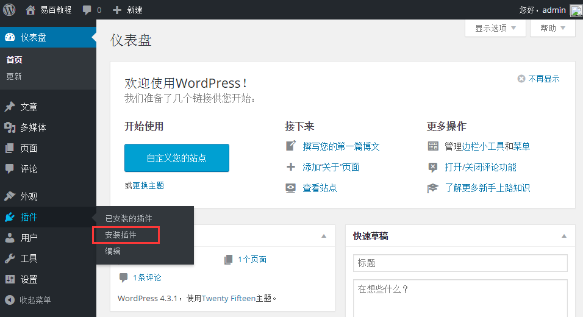

**第2步：**接下来，会出现下面的页面。

在这里，在这个部分中，您可以查看已经安装的插件。

**第3步：**点击 **插件**-&gt;**安装插件**，如下图所示

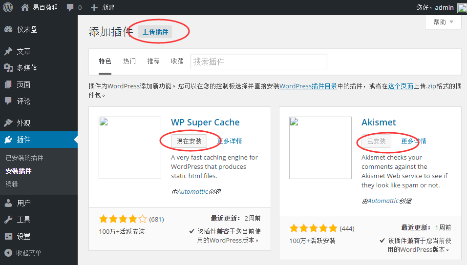

**第4步：**接下来，WordPress所使用的插件列表就会出现如图。在这里，您可以直接从可用列表中安装插件，也可以点击上传插件。

*   当你点击上传插件，会得到如下页面。

    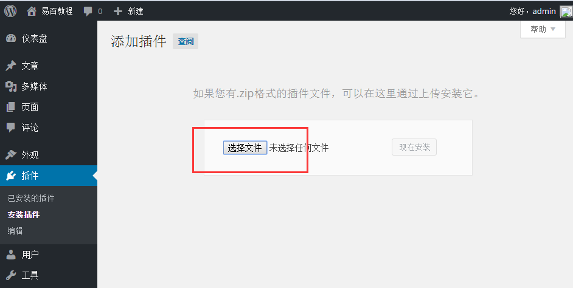

    点击浏览需要回到页面，可以从WordPress网站选择插件。如果点击选择文件，可以从你的系统中添加文件。

*   否则，在这里我们可以直接选择所需要的插件，然后点击**立即安装**，如下图所示。

    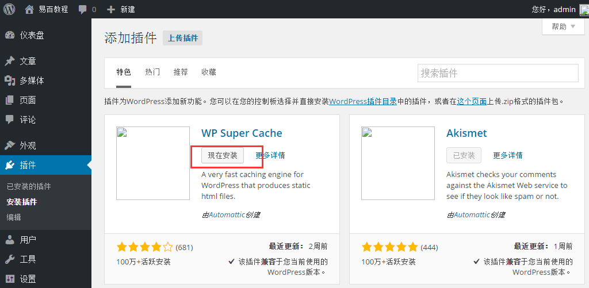

    当你点击立即安装，包开始变成下载并安装。后来，点击 **启用插件**，以活动插件在WordPress中使用，如下图所示。

    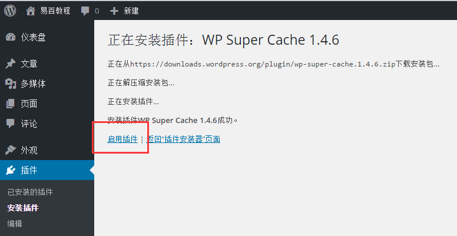

    点击启动插件后，会得到一个消息插件激活，也可以在列表中找到已安装的插件。

    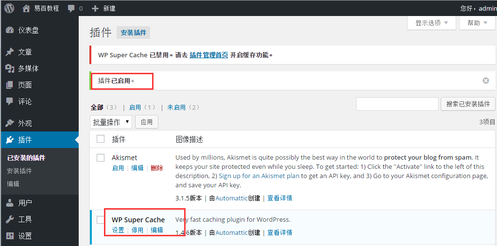

    下面给出的插件激活的消息，可以查看一些选项，比如**全部**，**启用**，**未启用**。

    *   当点击**启用**出现以下页面。在这里，您可以查看所有已**启用**的插件。

        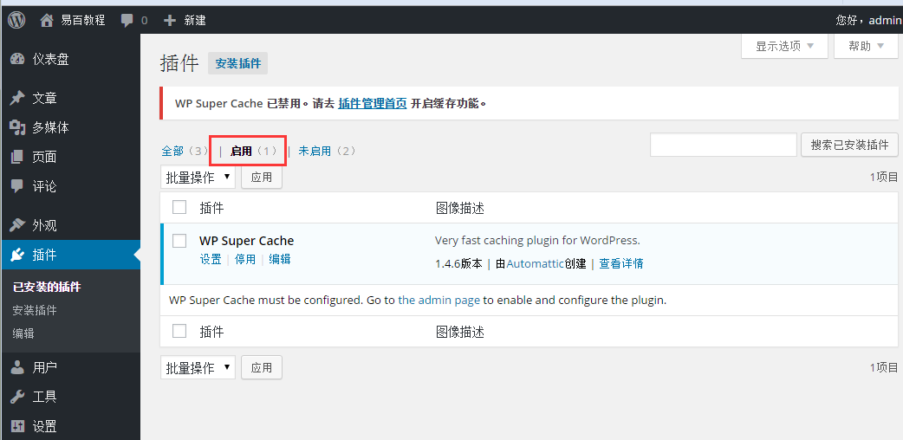
    *   当我们点击停用，获取显示其可用但没有被激活的插件。可以通过点击启动激活此插件。

        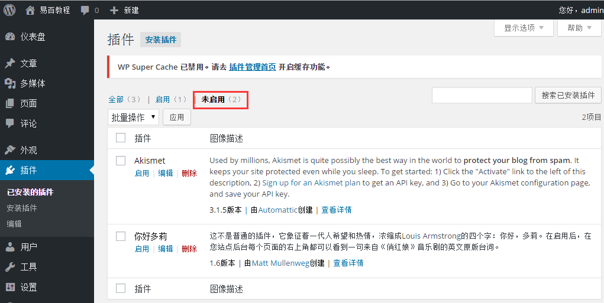
    *   点击**批量操作**，选择选项，然后点击应用按钮，可以**更新**，**删除**，**启用**各个插件。

        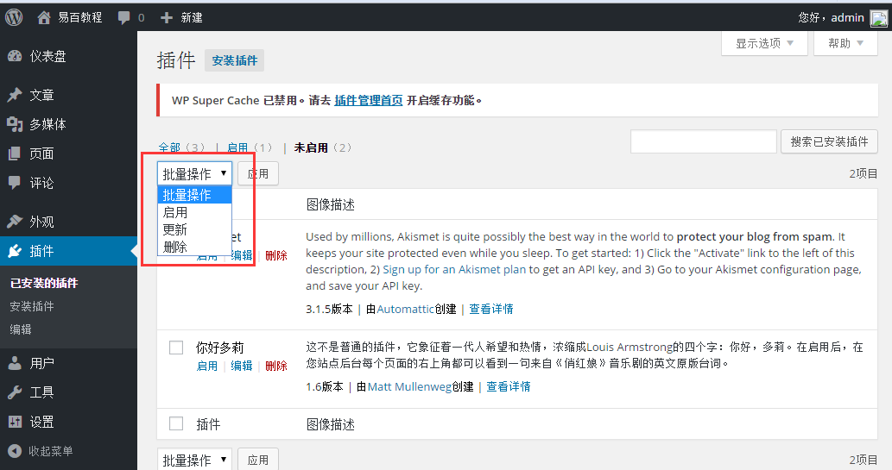
    *   在搜索已安装的插件，可以只输入插件名称在文本框，然后点击搜索已安装的插件按钮，当点击搜索安装插件按钮，进入以下页面与相应的插件。这里我们假设搜索：wp 相关插件。

        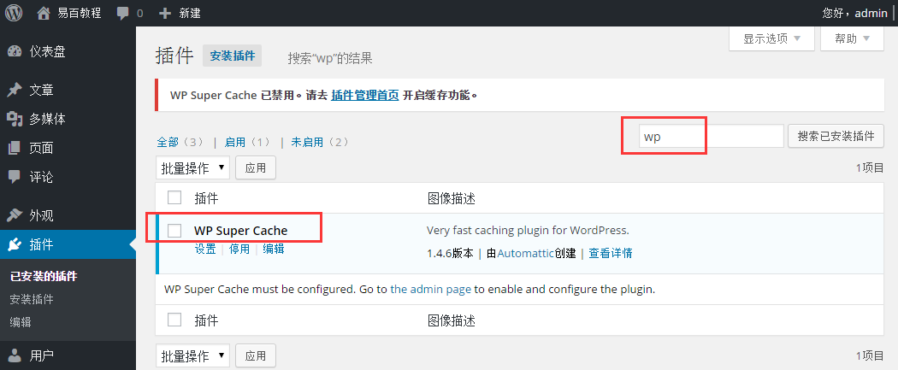

**第5步：**从边栏点击 **插件** -&gt;**编辑器**。

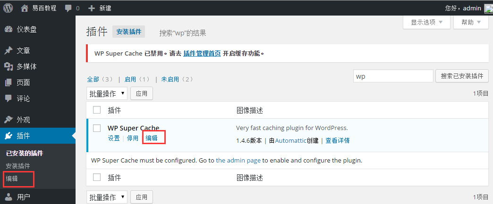

**第6步：**接下来，被显示在下面的页面。

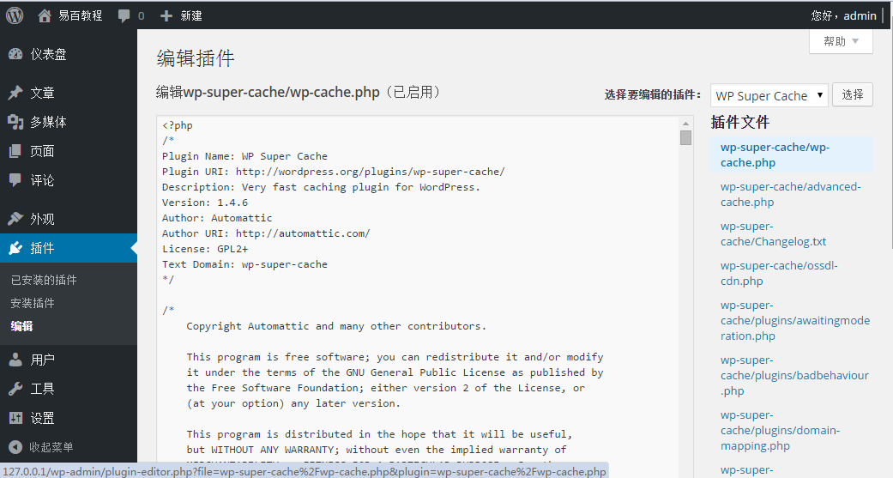

此页面允许编辑插件。在这里，我们有一个解释几个选项，如下：

*   **选择插件编辑：**下面请从下拉列表中选择插件并进行编辑。

*   **文档：**这里从下拉列表中选择工具来编辑插件。

*   **插件文件：**在这里，可以从列表中选择文件并编辑。

编辑插件文件完成后，点击更新文件
