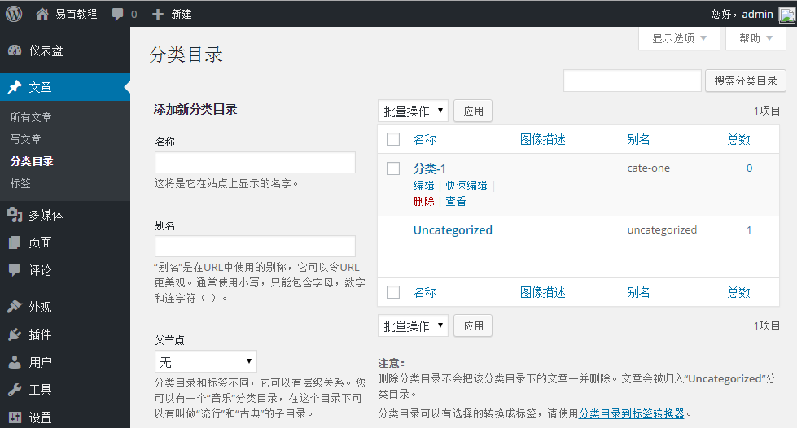

# Wordpress添加分类目录 - Wordpress教程

在本章中，我们将研究如何添加WordPress的分类目录。分类目录用来指示你的网站，将相关文章帖子分类。 它排序分组内容分成不同的部分。这是一个非常方便的方式来组织文章。

要访问分类目录部分，只需遵循以下步骤：

**步骤(1)**- 在 WordPress中点击 **文章** &gt; **分类目录** 选项。

**步骤（2）：**接着，所示显示分类目录页面如下

以下是关于分类目录的字段细节。

*   **名称****:** 输入分类目录的唯一名称。

*   **别名****:** 它用指定在分类的URL中。

*   **父节点****:** 分类目录和标签不同，它可以有层级关系。可以有一个“音乐”分类目录，在这个目录下可以有叫做“流行”和“古典”的子目录。

*   **描述****:** 加入分类目录的简要说明。它是任选的。描述只会在一部分主题中显示。

**步骤（3）：**填写所有关于分类的信息后，单击添加新类别按钮。

**步骤（4）：** 在点击 添加新分类目录 之后, 如下图所示，新创建的类别将显示在页面右侧中。

 