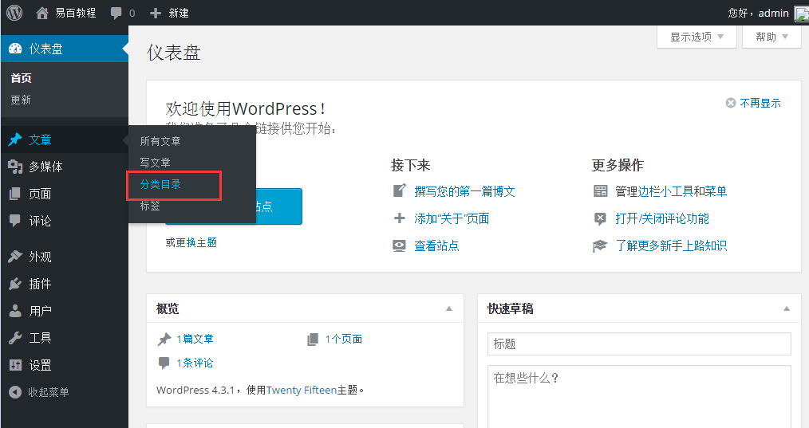
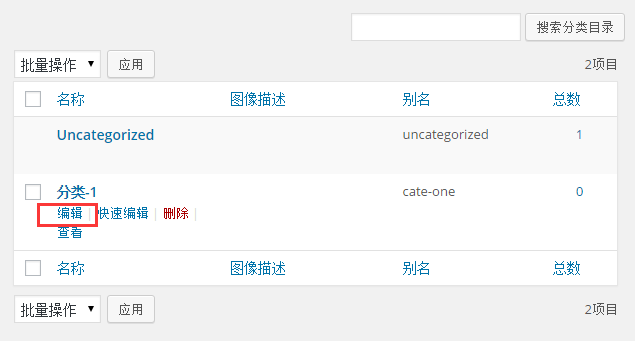
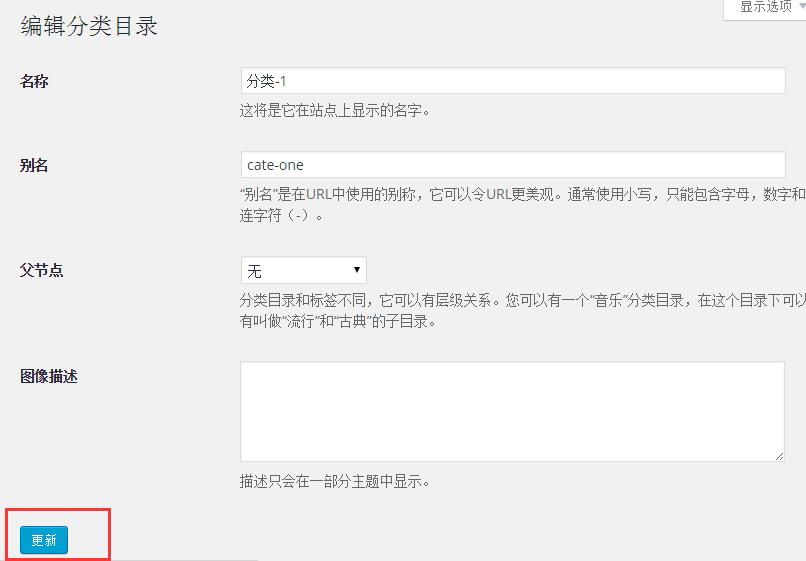
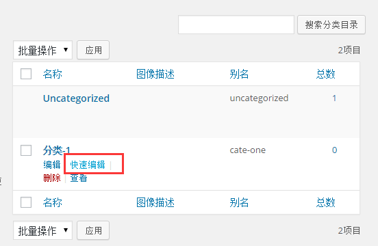
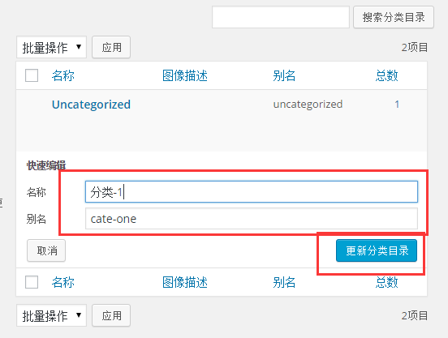

# Wordpress编辑分类目录 - Wordpress教程

在本章中，我们将学习简单的步骤来编辑WordPress中的分类目录。你可以学习如何在创建分类目录章节在 [Wordpress添加分类目录](http://www.yiibai.com/wordpress/wordpress_add_category.html)。

以下是简单的步骤，在WordPress中编辑分类目录。

步骤(1)：在WordPress中点击 文章-&gt;分类目录。

**步骤（2）：**接下来，你可以查看 **Category1** ( **Category1** 是在 [Wordpress添加分类目录](http://www.yiibai.com/wordpress/wordpress_add_category.html) 本章中创建 )。当光标悬停在分类目录上，然后几个高级选项显示类别名称的下面。进行编辑分类目录有两种方式即 **编辑** 和 **快速编辑**：

*   **编辑**: 单击在类别部分编辑选项，如下图所示。

    

    可以编辑任何必填字段，然后点击更新按钮，如图下面屏幕。

    

    在这里，分类字段与 [Wordpress添加分类目录](http://www.yiibai.com/wordpress/wordpress_add_category.html) 中的字段相同。

*   **快速编辑**: 点击**快速编辑选项分**类目录部分，如下图所示。

    

    在这里，你只能编辑如下图所示的分类目录的名称等，然后点击更新分类按钮。

    

 