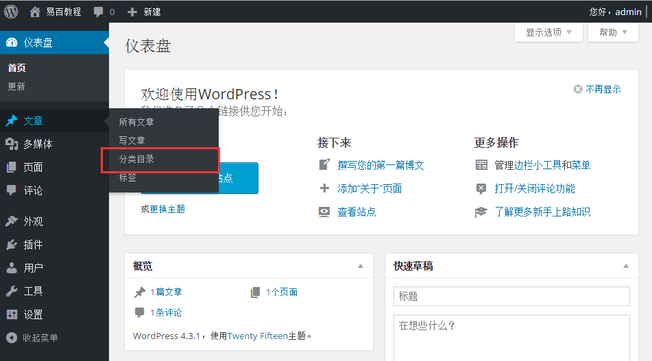
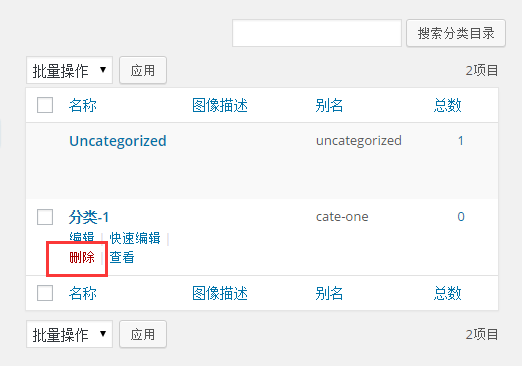
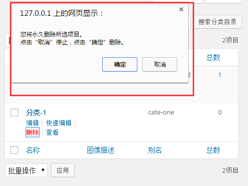

# Wordpress删除分类目录 - Wordpress教程

在本章中，我们将学习研究如何在WordPress中删除分类目录。 你可以学习如何创建类别: [Wordpress添加目录分类](http://www.yiibai.com/wordpress/wordpress_add_category.html)

以下是简单的步骤，用来在 WordPress 删除分类目录。

**步骤(1)：**在WordPress中点击 **文章**-&gt; **分类目录**。

**步骤（2）：**接下来，可以删除 **分类-1**（这是在 WordPress添加分类目录这一章中所创建的）。当光标悬停在类别，然后几个高级选项会显示在类别名称下面。点击删除类别部分，如下图所示。

当点击删除，会得到一个弹出消息，要求确认删除特定分类目录，如下图所示。

您可以点击 **确定** 按钮，并永久删除分类目录。

 