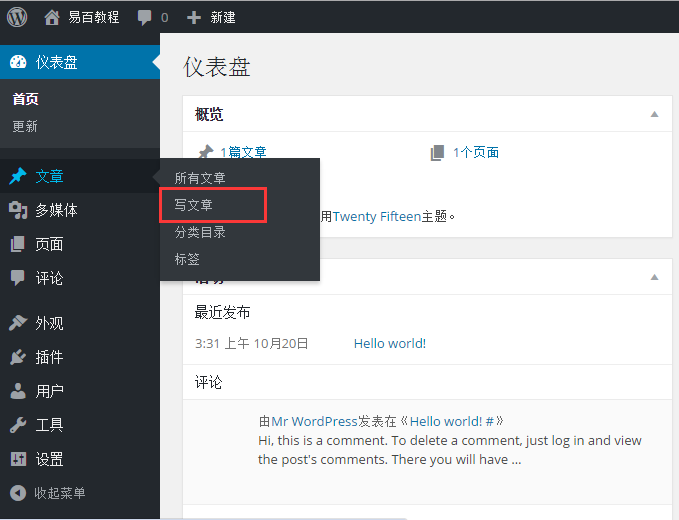

# WordPress添加/发布文章 - Wordpress教程

在本章中，我们将研究如何在WordPress中添加/发布文章。帖子也被称为文章，有时也被称为博客或博客文章。这些都是用来推广您的博客。

以下是简单的步骤来在WordPress中添加/发布文章。

第1步：在WordPress中点击 文章-&gt;写文章。

**第2步：**接下来，将获得文章的编辑页面，如下图所示。可以使用 WordPress 的所见即所得编辑器来添加您的文章内容。我们将学习详细的所见即所得编辑器在 [Wordpress添加页面](http://www.yiibai.com/wordpress/wordpress_add_pages.html) 章节中。

以下是目前在添加文章页面编辑器页面中的字段。

*   **文章标题：**输入文章标题，如 POST1

*   **文章内容：**输入文章的内容

第3步：接下来，点击发布按钮来发布的文章。

以下是几个选项会显示在发表部分。

*   **保存草稿****:**它保存文章后成稿

*   **预览****:**可以在发布前预览您的文章。

*   **移到废纸篓****:** 删除文章

*   **状态:**更改后行列式的状态：发布，待审草案

*   **可见度:**更改后可见性，即公开，私人或密码保护

*   **发表:**更改后发表文章的日期和时间

 