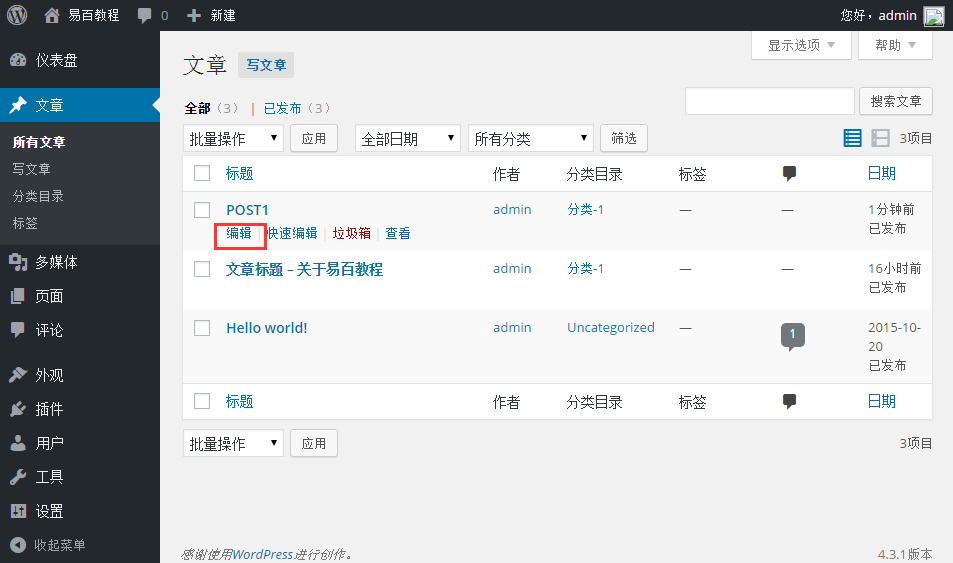
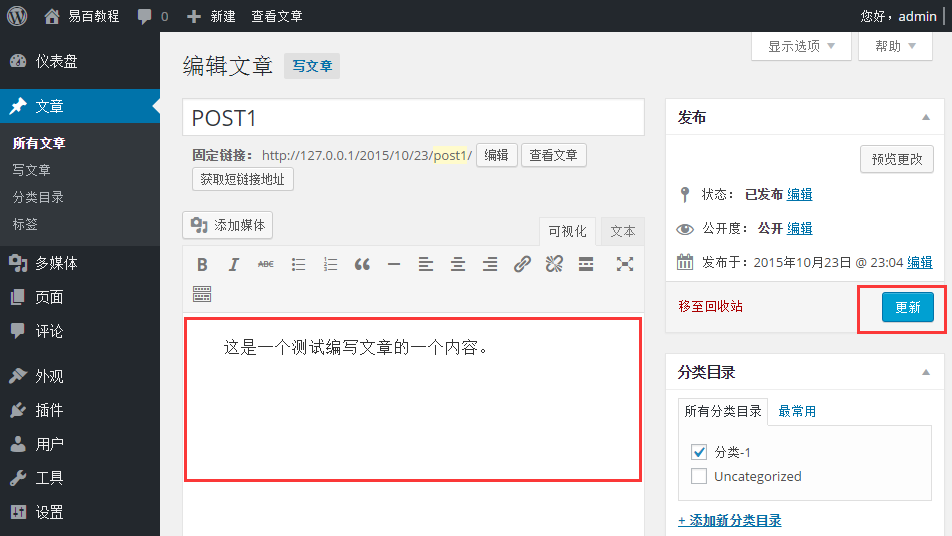
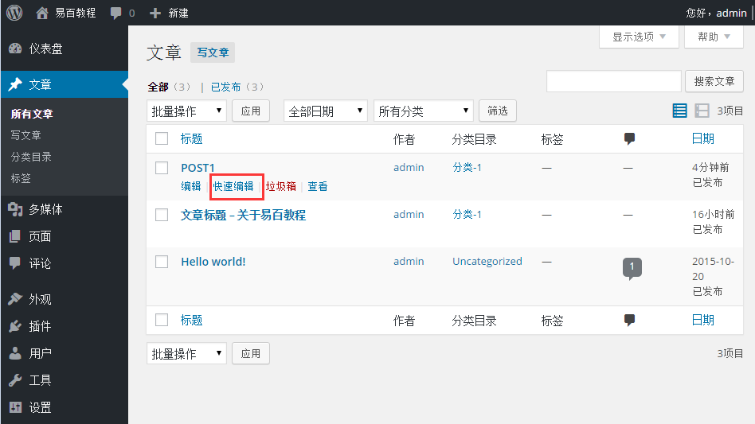
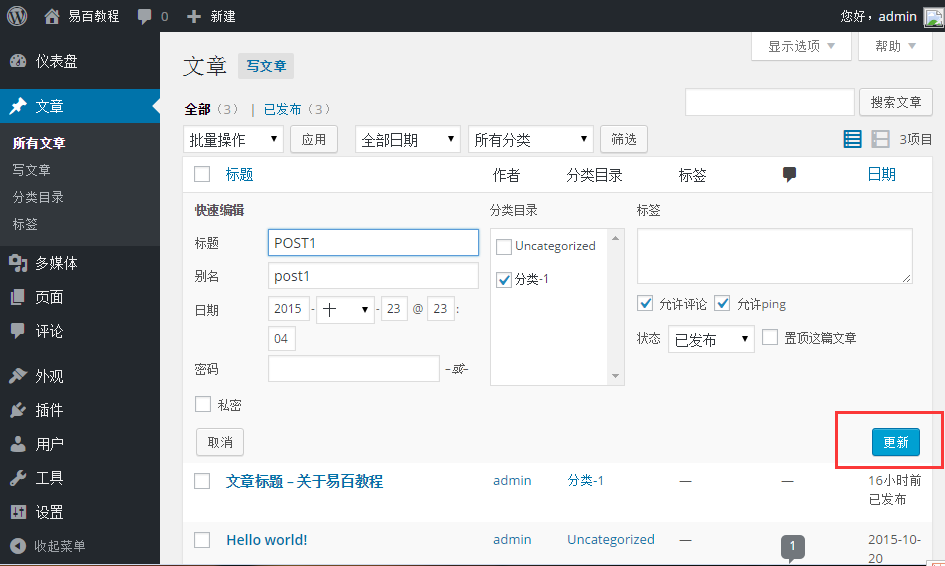

# WordPress编辑修改文章 - Wordpress教程

在本章中，我们将学习，如何在 WordPress 中编辑修改文章。可以先学习如何新增文章 [Wordpress新添文章](http://www.yiibai.com/wordpress/wordpress_add_posts.html)

以下是简单的步骤来在WordPress编辑文章/帖子。

**步骤(1)：**在WordPress中点击 **文章** -&gt; **所有文章**。

**步骤(2)：**接下来，你可以查看 **Post1** (Post1 是在 [Wordpress添加文章](http://www.yiibai.com/wordpress/wordpress_add_posts.html) 本章创建), 当光标悬停在后，几个高级选项显示在文章名称后面。有两种编辑方式，即：编辑和快速编辑。

*   **编辑：**如下图所示，点击 **POST1** 的编辑选项。

    

    可以按您需要编辑或更改内容或标题之后，然后点击 **更新** 按钮，如图下面的屏幕。

    
*   **快速编辑：**点击在 POST1 的快速编辑选项，如下图所示。

    

    在这里，您可以编辑文章的标题，日期并且还可以选择文章的分类，如下图所示，然后点击**更新**按钮。

    

 