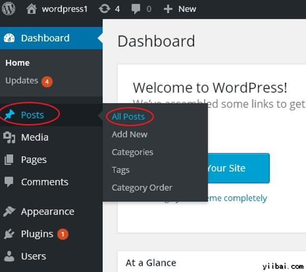
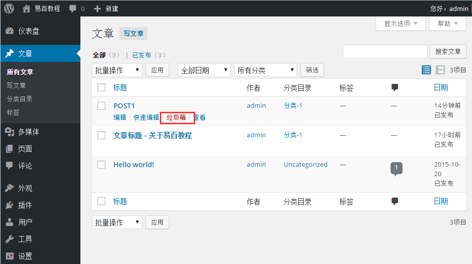
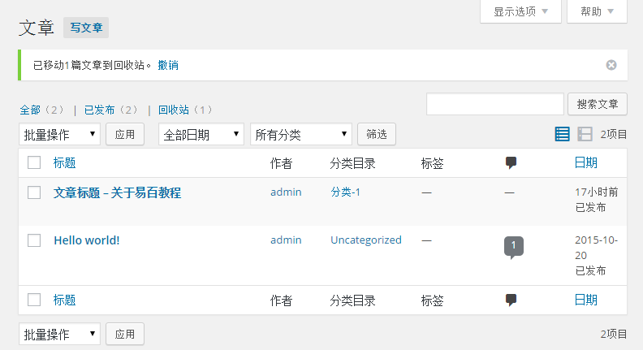

# Wordpress删除文章 - Wordpress教程

在本章中，我们将学习如何在WordPress中删除文章。可以学习如何添加文章在 [Wordpress添加文章](http://www.yiibai.com/wordpress/wordpress_add_posts.html) 章节。

按照以下步骤在WordPress删除文章。

**步骤(1)：**在Wordpress中点击 **文章 **-&gt; **所有文章**。

**步骤（2）：**接下来可以删除POST1（POST1是在 [WordPress添加文章](http://www.yiibai.com/wordpress/wordpress_add_posts.html) 这一节中创建的），当光标悬停在后，在 POST1 下方显示那几个高级选项。点击 **垃圾箱** 选项删除该文章。

**步骤（3）：**接下来，可以查看您的文章列表以确认上面的帖子被删除。

 