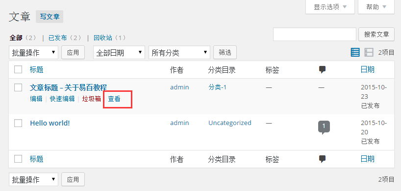
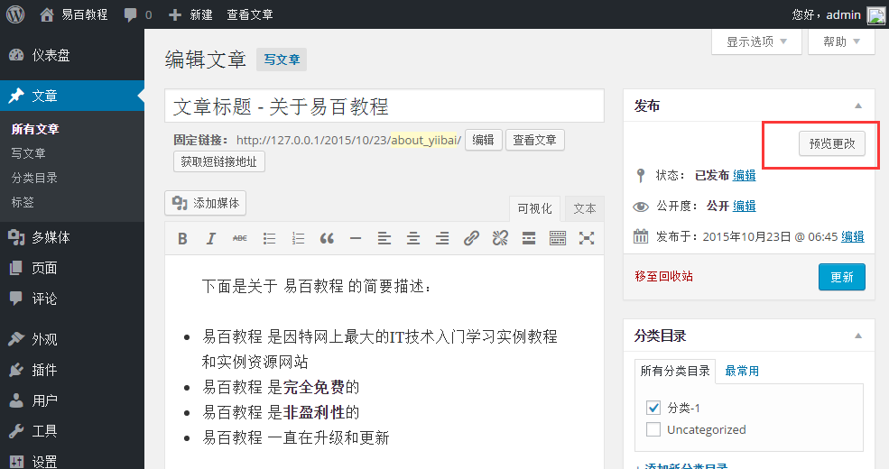
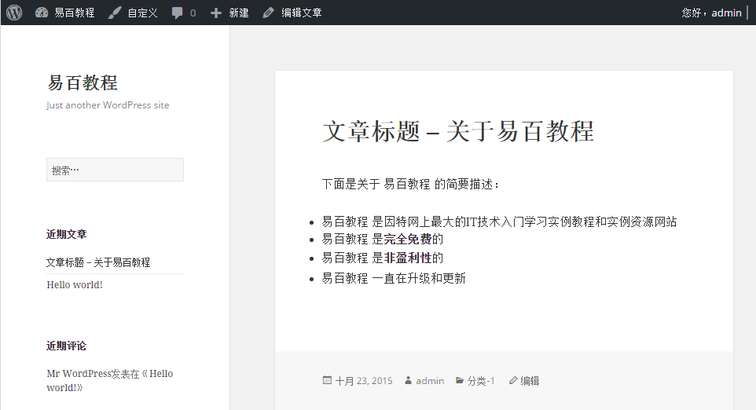

# Wordpress预览文章 - Wordpress教程

在本章中，我们将学习如何在WordPress中预览文章。预览文章是查看这篇文章发布给用户之前。安全预览文章，并确认在看后是否要发布到网站上。可以根据您的需要编辑在预览后更改后。

以下是简单的步骤来在WordPress中预览文章。

**步骤(1)：**在WordPress中点击 **文章 **-&gt; **所有文章**。

****

或者可以直接查看您的文章，当编辑时点击预览按钮添加后如下图所示

**步骤（3）：**接下来，当你点击观看或预览，可以查看您的文章如下图所示。

 