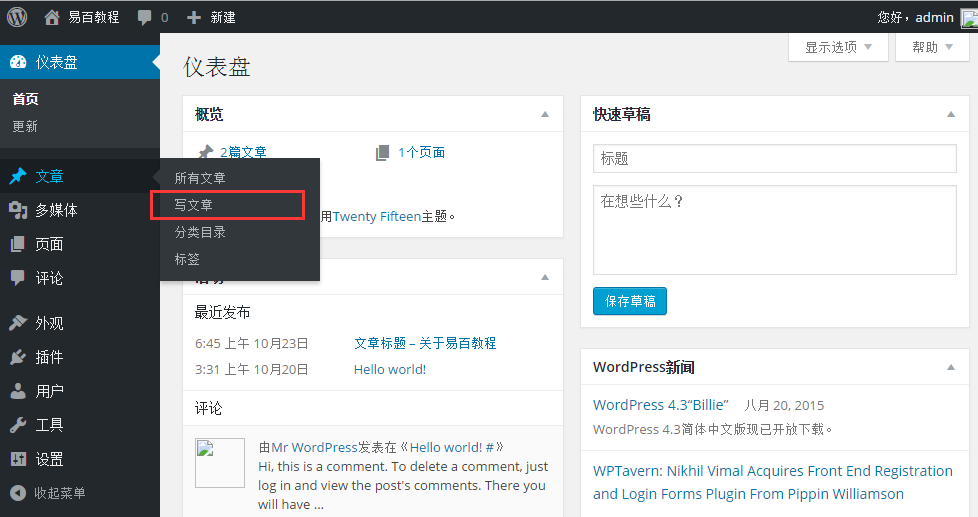
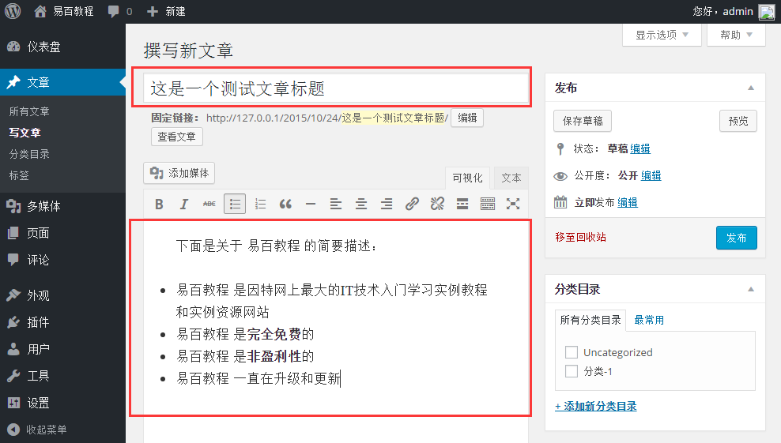
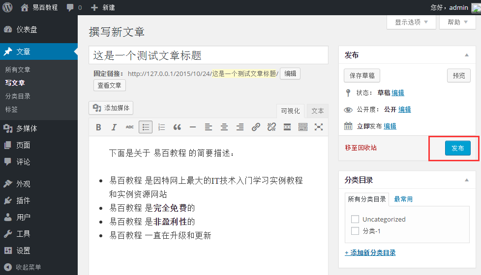

# Wordpress发布文章 - Wordpress教程

在本章中，我们将学习如何在WordPress中发布文章。发布是用来提供给所有用户，每个用户都可以查看某个文章的发布。在WordPress发布一个新的文章是一个简单的过程。

下面是在WordPress发布文章的步骤。

**第1步：**在 WordPress 中点击 **文章** -&gt; **写文章**。

**第2步：**接下来，将获得文章的编辑页面，如下图所示。您可以使用 WordPress 的所见即所得的编辑器添加/编写文章的内容。

**第3步：**接下来，点击 **发布** 按钮来发布文章。

点击 **发表** 后您的文章得以发表，供用户查看。

 