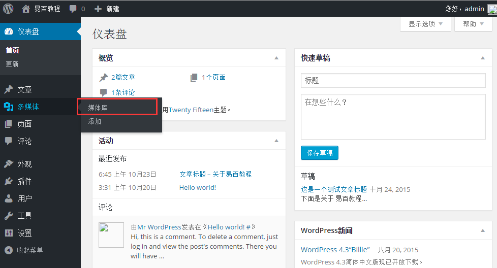
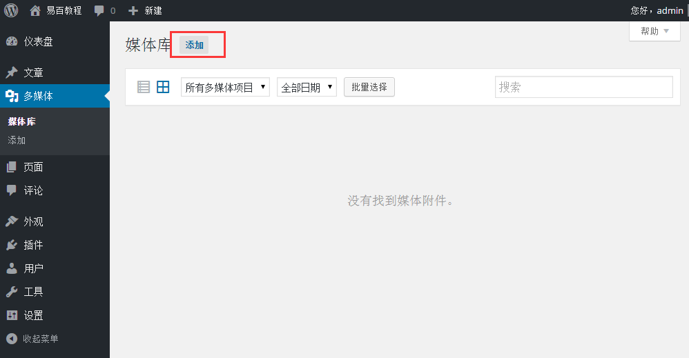
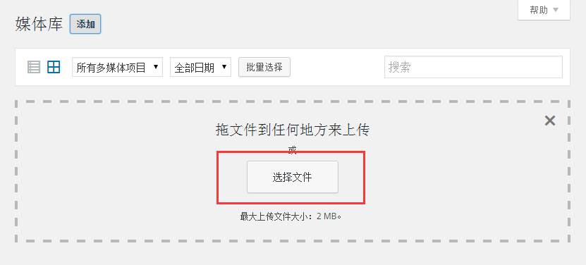
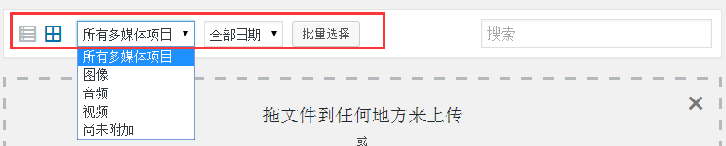
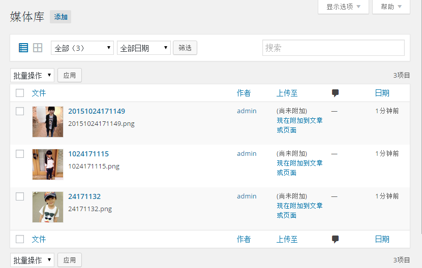
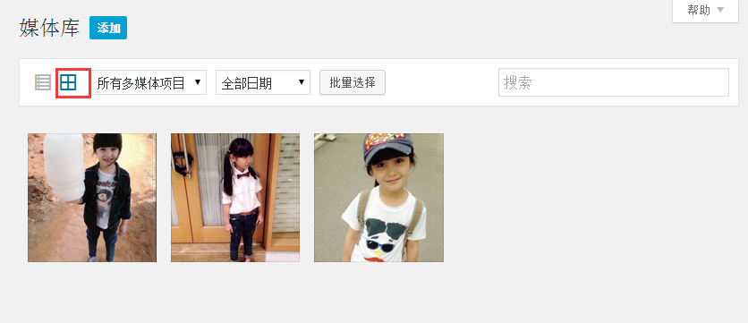

# WordPress媒体库 - Wordpress教程

在本章中，我们将了解 WordPress 中的媒体库。媒体库包括图像，音频，视频和文件，可以写一个文章或网页时上传并添加到内容中。在这里可以看到，添加，编辑或删除任何媒体相关的对象如果没有必要时。

下面是了解有关媒体库的步骤。

**步骤(1)：**在 WordPress 中点击 多媒体-&gt; 媒体库。

**步骤（2）：**接下来，可以看到如图像，音频，视频媒体文件。单击 添加 媒体按钮。

**步骤（3）：**接下来，获取显示上传新媒体页面。可以了解如何添加媒体在 [WordPress添加媒体](http://www.yiibai.com/wordpress/wordpress_add_media.html) 。

**步骤（4）：**接下来，可以看到一些工具条，如下图所示。

*   **列表视图：**显示图像和视频在列表形式。

    
*   **网格视图：**以网格格式显示所有图像，如下图所示。

    
*   过滤图像和视频它过滤图像和视频。

*   **搜索框：**通过将名称在框中搜索特定的图像。

 