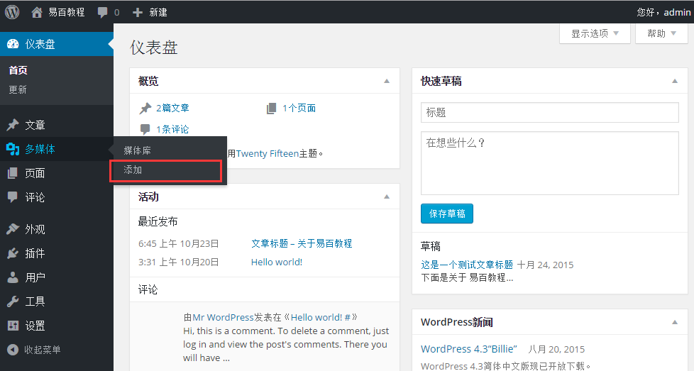
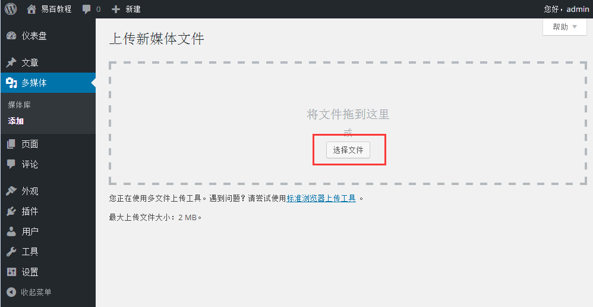
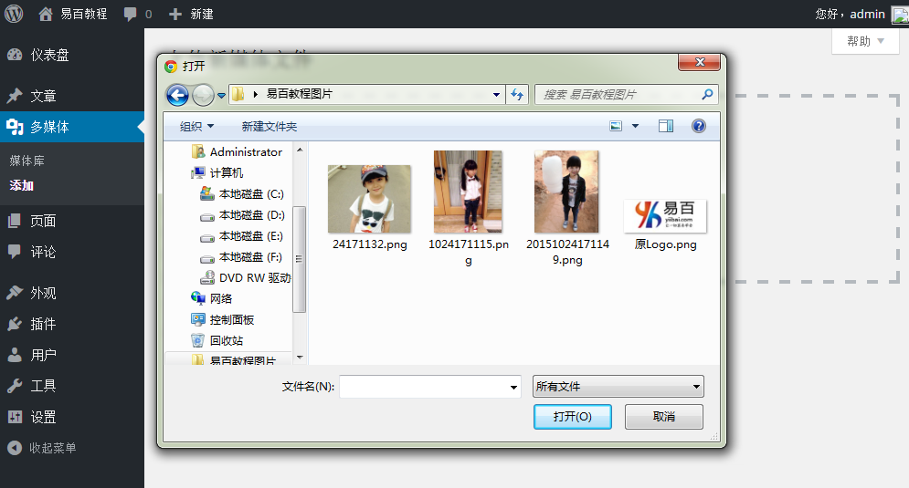
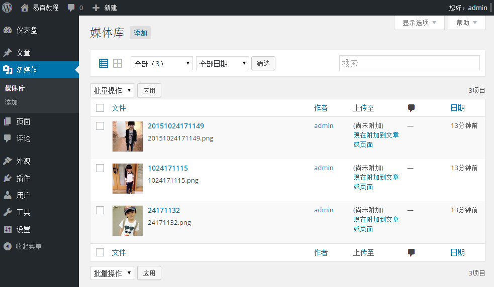

# Wordpress添加媒体 - Wordpress教程

在本章中，我们将学习如何在 WordPress 中添加媒体文件。WordPress允许你添加类似视频，音频和图像的媒体文件。

按照以下步骤来添加媒体。

**步骤(1)：**在WordPress中点击 **媒体** -&gt; **添加**。

**步骤（2）：**接下来，点击 选择文件 选项从本地存储选择，如下图所示的文件。

**步骤（3）：**接下来，选择 添加媒体文件 如下图所示，如图像和音频。

**步骤（4）：**接着，可以查看添加后的媒体文件的列表，如下所示。

 