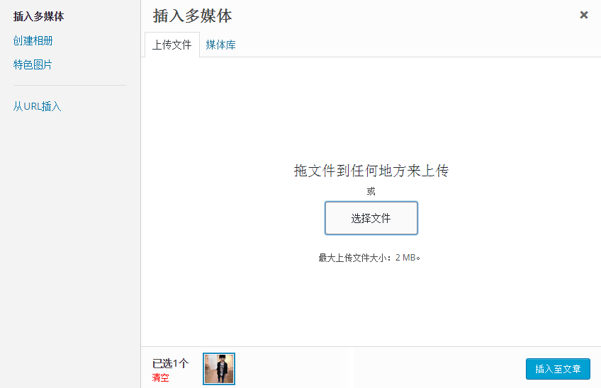

# WordPress插入媒体 - Wordpress教程

在本章中，我们将学习如何在WordPress中插入传媒。媒体文件可以从本地存储或从网址插入到您网页或文章。

按照以下在 WordPress 中插入媒体的步骤。

**步骤(1)：**在 WordPress 点击 **文章** -&gt; **写文章**

**步骤（2）：**接下来，单击 **添加媒体**。

**步骤（3）：**可以从媒体库选项卡中选择文件，如下图所示。

关于所选择的媒体文件的信息，将显示在屏幕右侧的附件详细下。单击 **插入至文章**，图像将被插入到文章。在附件详细信息部分，可看到如URL，标题，图片说明，替换文本和描述的图像信息。或者可以直接从系统通过对已上传文件选项卡插入图片。点击 **插入至文章** 按钮。

 