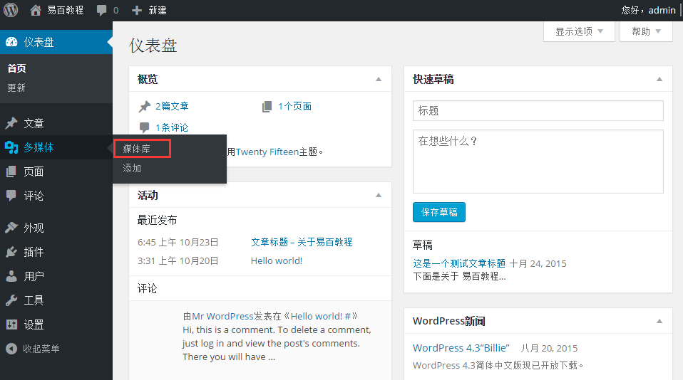
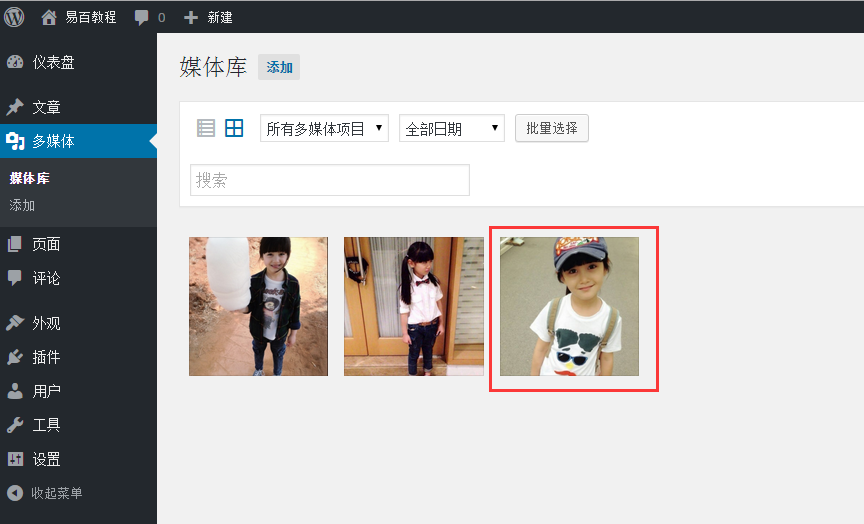
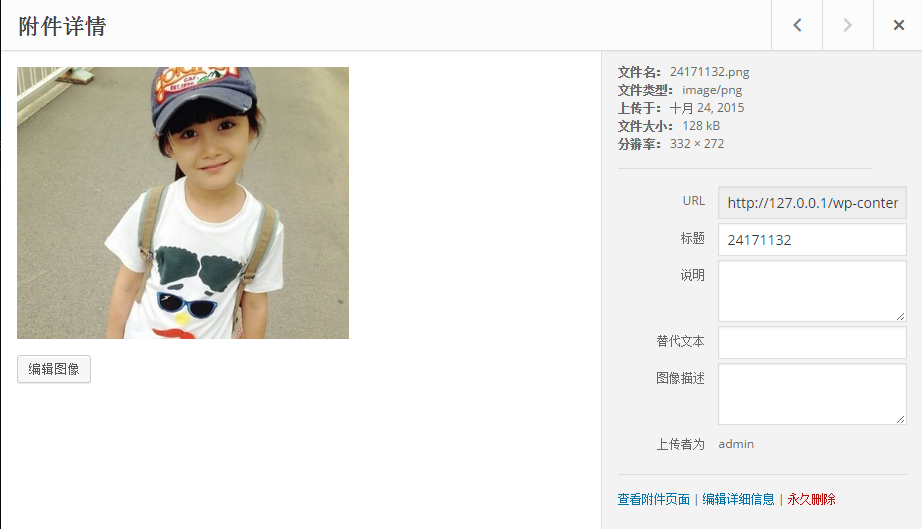
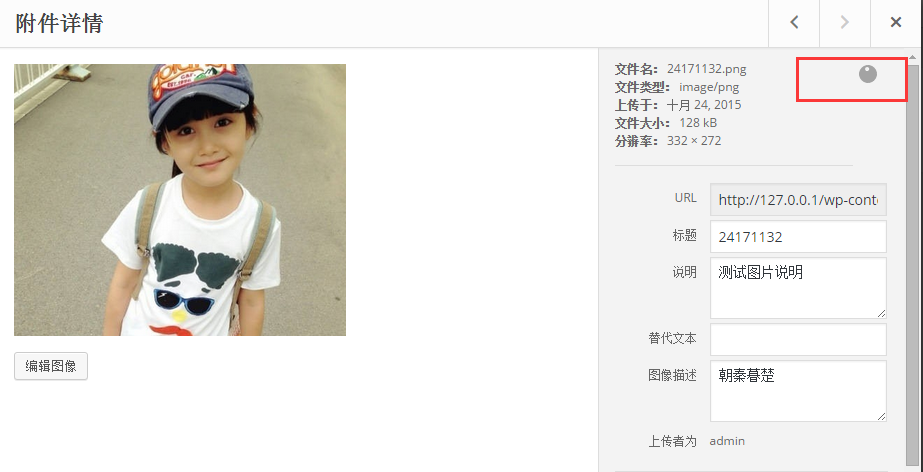

# WordPress编辑媒体 - Wordpress教程

在本章中，我们将学习如何编辑WordPress中的媒体。可以管理所有关于你的媒体，保存在媒体库中的信息。

以下是WordPress中编辑媒体的步骤。

**步骤(1)：**点击 多**媒****体** -&gt; **媒体****库**，然后单击媒体项目或编辑链接的名称。

**步骤（2）：**浏览的媒体文件列表。选择任意一个图像编辑。

**步骤（3）：**接下来，可以在右侧几个选项查看编辑媒体页面。

*   **URL****:** 可以从一个链接读取媒体文件。

*   **标题****:** 这显示了媒体的名称。标题通常以画廊和附件页面上显示，如果主题或插件设计显示它。

*   **替代文本****:** 图像的 alt 文本，这是用于描述媒体。用于可用性。

*   **图像描述：**媒体文件的解释。

*   **永久删除：**永久删除您的媒体文件。

**步骤（4）：完成编辑所需的字段后，图像所做的更改会自动保存。**

 