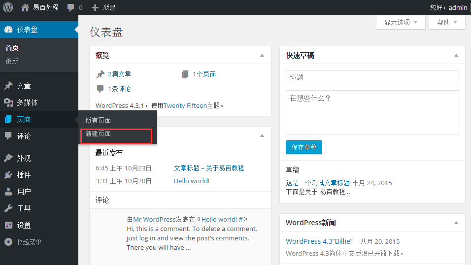
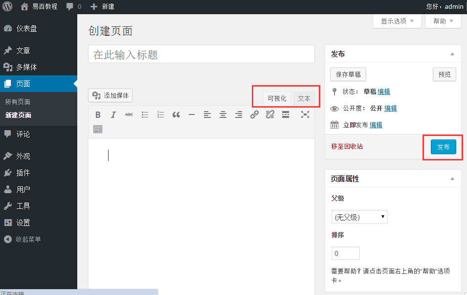
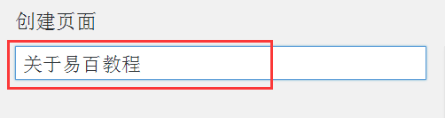
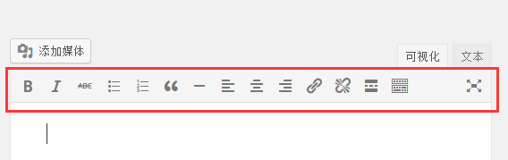
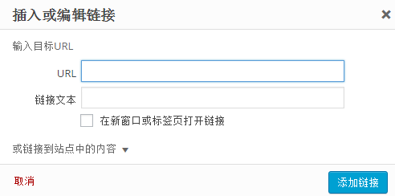
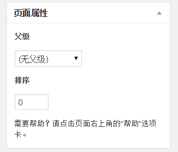

# WordPress添加页面 - Wordpress教程

在本章中，我们将学习如何在WordPress中添加页面。添加页面类似于WordPress的增加文章。页面是静态内容往往不是经常改变其显示的信息。

以下是在WordPress中添加页面的简单步骤。

**步骤(1)：**点击 **页面** -&gt; **新建页面**，如下图所示。

**步骤（2）：**接下来，将得到编辑的页面，如下图所示。在下面的图片可以看到，在编辑器页面有两个标签，视觉和文本。在这里可以插入两种文本。在这里，我们将学习有关将文本转换成可视格式。

以下是在添加新页面编辑器页面中的字段的详细信息。

## 标题

它用于写文章，这是在页面上之后显示标题。

固定链接示出了用于下文的标题的页面潜在的网址。这个 URL 是按照给定的标题生成。

## WYSIWYG 编辑器

这是一个所见即所得的编辑器，这类似我们编辑文章的内容文字处理器接口。

下面是目前所见即所得的编辑器的选项

*   粗体按钮：用于加粗字体。

*   斜体：用于斜体字体。

*   项目符号列表：它增加了项目符号的内容。

*   编号列表：这可以添加数字内容的列表。

*   大段引用：它引用文字。

*   水平分割线：创建一个横线在句子之间。

*   左对齐：将在页面左侧对齐内容。

*   右对齐：设置内容的页面右侧对齐。

*   对齐：设置在页面的中心对齐内容。

*   添加链接：它允许添加一个链接到您的内容。当点击这个按钮，显示以下页面。

    

## 文本插入

它用于写文章内容。

## 发布

发布页面到网站上给用户。

## 页面属性

页面属性模块允许您选择的父级页面为特定页面。还可以设置顺序页面。

*   父级：允许您选择父页面。

    
*   顺序：设置页面的顺序。

## 特色图像

它包括在网页中的图像。

 