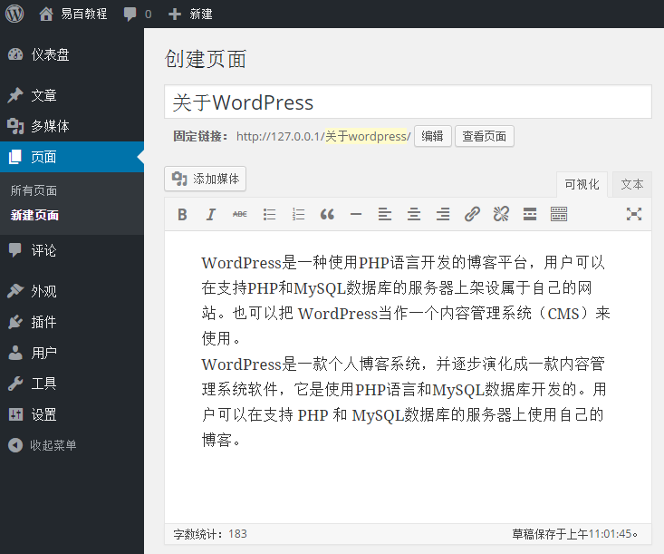
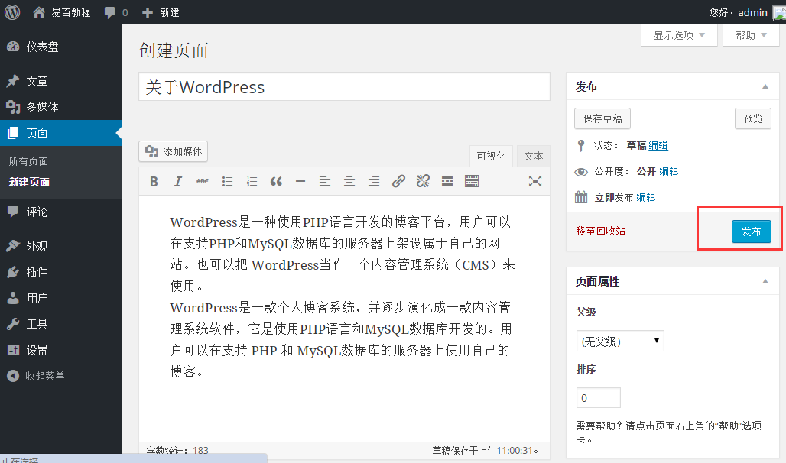

# WordPress发布页面 - Wordpress教程

在本章中，我们将学习如何在WordPress发布页面。 发布提供给所有用户，使得每个用户可以查看该特定页面的页面。在WordPress发布一个新的页面是一个简单的过程。

按照以下步骤来在WordPress中发布页面。

**第1步：**在 WordPress 中点击 **页面** -&gt; **新建页面**。

**第2步：**接下来得到编辑器，如下图所示。可以使用 WordPress 的所见即所得编辑器来添加您的网页的实际内容。

****第3步：****如下图所示接下来，点击发布按钮。

点击后 **发布** 后您的文章得以发表，供用户查看。

 