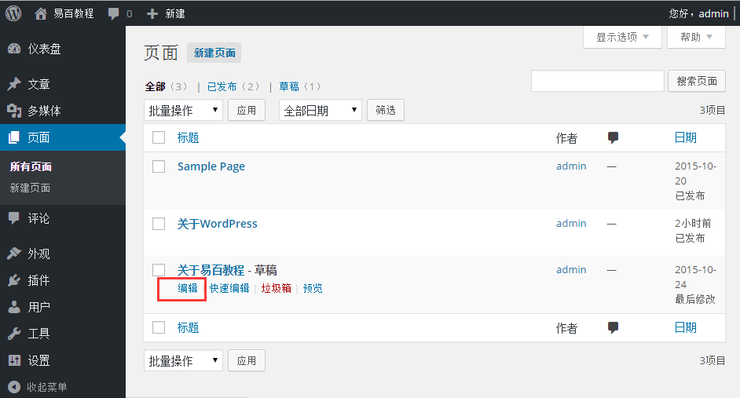
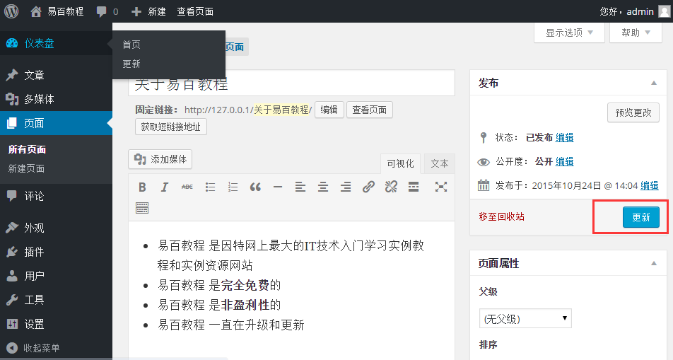
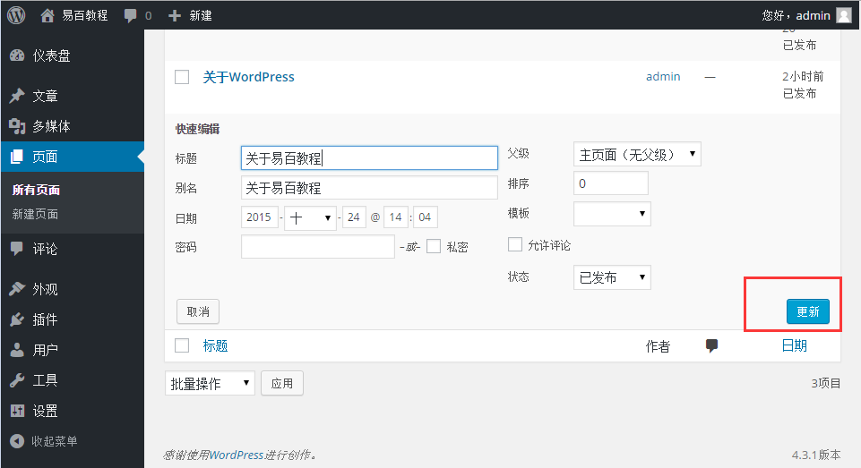

# WordPress编辑页面 - Wordpress教程

在本章中，我们将研究如何来编辑 WordPress 的页面。你可以学习如何添加页面在 [WordPress添加页面](http://www.yiibai.com/wordpress/wordpress_add_pages.html)。

**步骤(1)：**在 WordPress 点击 **页面** -&gt;**所有页面**，如下图所示。

**步骤（2）：**接下来，可以查看关于我们（关于我们已在 WordPress添加页面 这一章中创建）。当光标悬停在页面，然后选择几个选项得到下面 关于我们 的显示。之后编辑它们，即编辑和快速编辑两种方式。

*   编辑：点击编辑选项关于我们如下图所示。

    

    可以编辑或更改网页内容或标题按，然后点击更新按钮，如下面的图。

    
*   快速编辑：单击快速编辑选项关于我们如下图所示。

    

    在这里，您可以编辑标题和关于我们页面的日期，也可以选择父页面，如下图所示，然后点击更新按钮。

    

 