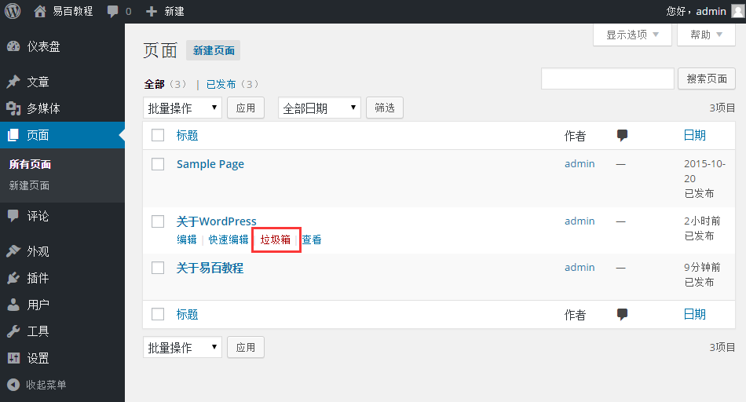
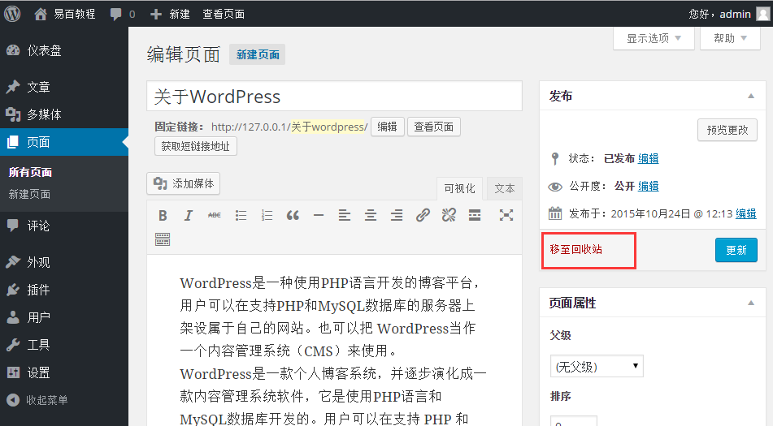
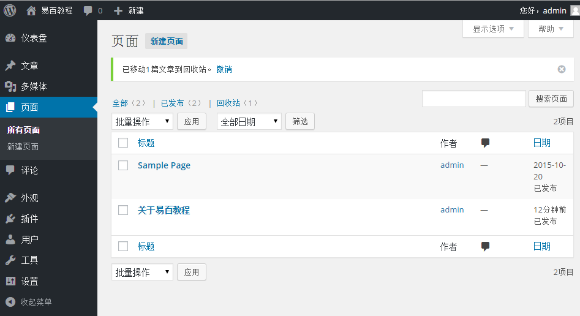

# WordPress删除页面 - Wordpress教程

在本章中，我们将学习如何在WordPress中删除页面。你可以学习如何添加页面在 [WordPress添加页面章节](http://www.yiibai.com/wordpress/wordpress_add_pages.html) 。

按照以下步骤删除WordPress的页面。

**第1步：**在WordPress中点击 **页面** -&gt;**所有页面**。

****第2步：****接下来，可以删除示例页面（示例页面是WordPress创建默认的）。当光标悬停在网页，几个选项显示在示例页面的下面。点击垃圾箱选项删除该文章页面。

或者可以直接删除页面，同时编辑或点击移动网页添加到垃圾桶，如下图所示：

**第3步：**接下来，以确认已删除的页面，查看您的网页列表。

 