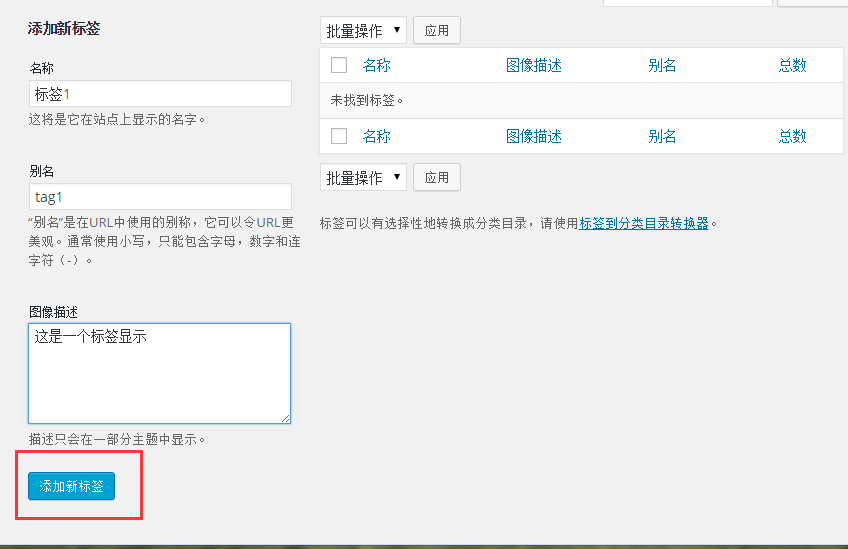

# Wordpress添加标签 - Wordpress教程

标签附加用于识别主要内容或文章信息的目的。它告诉访问者实际的文章是什么。如果所提到的标签正确，那么它有助于找到内容。

按照以下步骤在WordPress中添加标签。

**第1步：**在WordPress点击 **文章**-&gt; **标签**。

**第2步：**接着，将显示标签页。

以下是标签字段的详细信息。

*   名字: 输入标签的名称。

*   别名: 它被指定在标签URL。

*   描述: 添加您的标签的简要说明。当在标签上悬停它就会显示出来。

填写所有关于标签的信息之后，点击添加新标签按钮。

****第2步：****接下来，如下图所示，新创建的标签将得到显示在页面右侧。

 