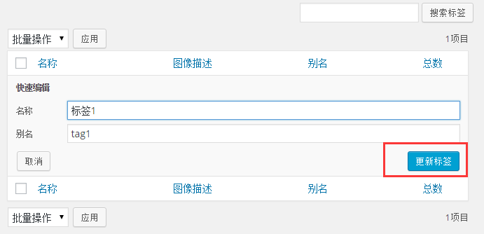

# Wordpress编辑标签 - Wordpress教程

在本章中，我们将学习在WordPress如何编辑标签。可以学习如何添加标签在[WordPress添加标签章节](http://www.yiibai.com/wordpress/wordpress_add_tags.html) 。以下是简单的步骤来在WordPress中编辑标签。

**第1步：**在WordPress点击 **文章**-&gt; **标签**。

**第2步：**接下来，你可以看到 tag1（tag1是在[WordPress添加标签](http://www.yiibai.com/wordpress/wordpress_add_tags.html)章节中创建）。当光标悬停在标签，有几个选项会显示在标签名称的下方。编辑标签有两种方式，即编辑和快速编辑

*   编辑：如下图所示，点击的标签部分中的编辑选项。

    

    您可以编辑任何必填字段，然后点击更新按钮，如图下面的屏幕。

    

    在这里，标签字段是和 [WordPress添加标签章节](http://www.yiibai.com/wordpress/wordpress_add_tags.html)是一样的。

*   **快速编辑：**如下图所示，点击的标签部分快速编辑选项。

    

    在这里，你只能编辑如下图所示标签的名称和别名，然后点击更新标签按钮。

    

 