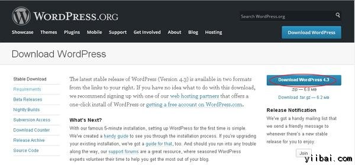
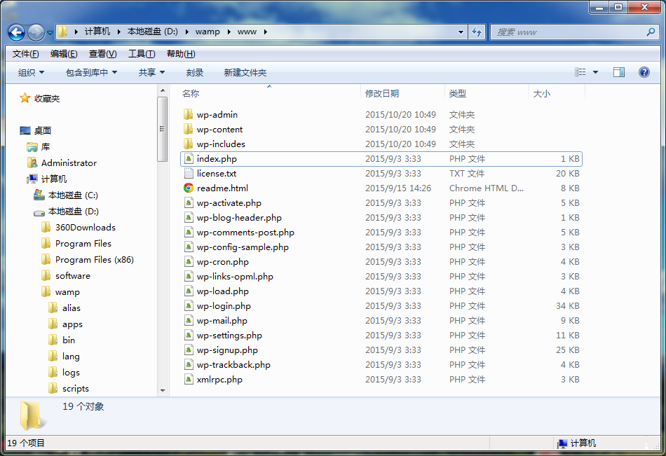
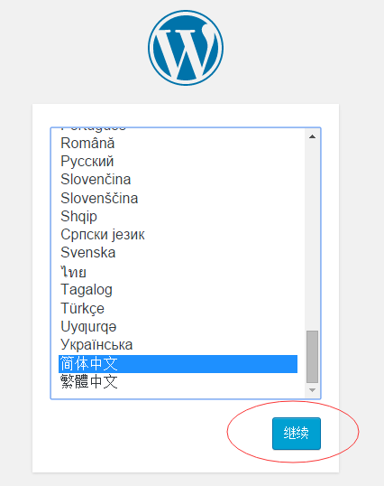
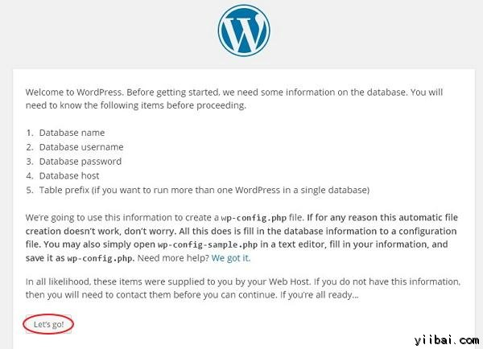
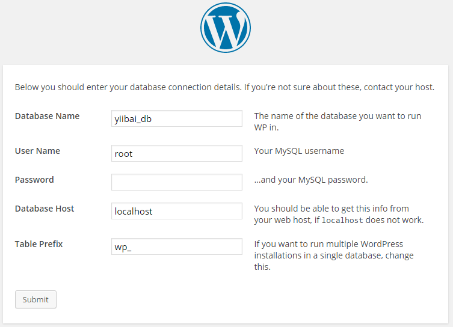
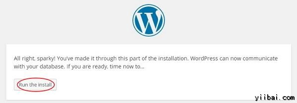
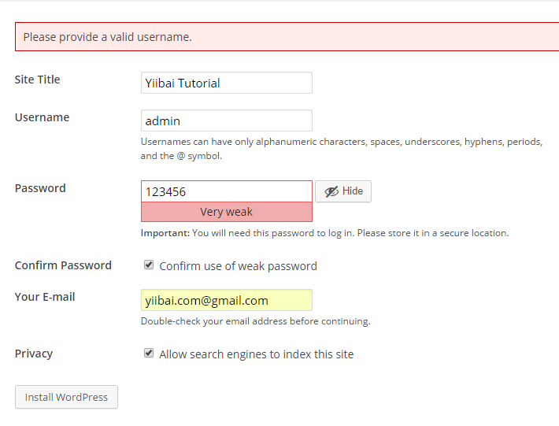
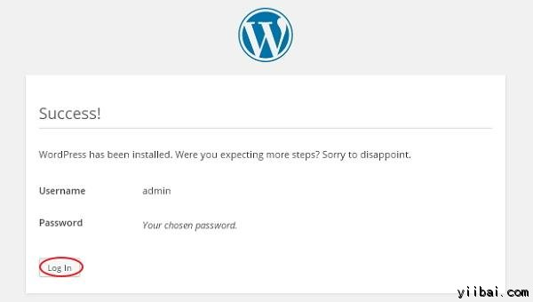
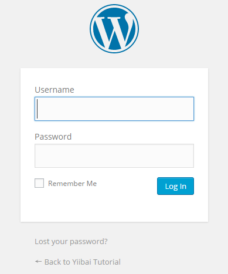

# Wordpress安装 - Wordpress教程

## WordPress系统要求

*   数据库 : MySQL 5.0 +

*   Web服务器：

    *   WAMP (Windows)

    *   LAMP (Linux)

    *   XAMP (Multi-platform)

    *   MAMP (Macintosh)

*   操作系统: 跨平台

*   浏览器支持 : IE (Internet Explorer 8+), Firefox, Google chrome, Safari, Opera

*   PHP兼容性 : PHP 5.2+

## 下载WordPress

当打开链接 [https://wordpress.org/download/](https://wordpress.org/download/), 将能看到一个屏幕，如下：

 请从官方网站WordPress 的 zip文件。

## 创建存储数据库

*   WordPress需要MySQL数据库。因此，创建用户名/密码（例如用户以“root”，密码为“123456”，也可以设置其它），并创建一个新的空数据库。

*   接下来，您可以继续安装过程如下文所述。

## 安装向导

这很容易安装 WordPress 在你的系统上。以下步骤描述了如何设置 WordPress 在本地系统上。

**步骤 (1):** 解压下载的WordPress的文件夹，并把它上传到Web服务器或本地主机，本示例中使用 Wampserver。

****步骤 (2):**** 打开浏览器，然后导航到 WordPress 文件路径，那么会得到WordPress的安装程序的第一个屏幕如在下面的屏幕。在我们的示例中，安装的路径是：D:wamp\www 目录，如下：

启动 WAMP，然后在浏览器中输入网址：http://127.0.0.1 ，如下所示：

为 WordPress 选择语言，然后点击继续。

步骤 (3): 在此步骤中，可以继续使用 WordPress 安装前查看所需的数据库中的信息。

点击 Let's go!

**步骤 (4):** 在这里，有如下的画面描述用来输入关于MYSQL数据库的信息。在操作这一步之前我们先创建一个数据库：yiibai_db。

*   **数据库名称 :** 输入您的WordPress要连接的MySQL数据库已经创建的数据库名（这里是：yiibai_db）。

*   **用户名 :** 输入您的MySQL数据库的用户名。

*   **密码 :** 输入您的MySQL数据库的密码。

*   **数据库主机：** 填写主机名，默认情况下它会被本地主机（localhost）。

*   **表前缀 :** 它被用来添加数据库中表的前缀，这有助于运行多个网站共享同一数据库。它采用默认值。

填充的所有信息后，点击 Submit 按钮。

**步骤 (5):** 在这里，WordPress的检查数据库的设置，让您的确认屏幕，如下图所示。

点周 **Run the install**

**Step (6):** 在这里，必须输入有关管理的信息。

它包含以下字段：

*   **Site Title:** 要创建的 WordPress(网络)的名字。

*   **Username:** 输入用户名，当您在登陆WordPress时使用。

*   **Confirm Password :** 确认使用弱密码

*   **Your E-mail:** 请输入您的电子邮件地址，这有助于恢复密码或任何更新。

*   **Privacy:** 它允许搜索引擎索引检查复选框后，这个网站。

填补所有的信息后，点击安装WordPress按钮。

**步骤 (7): **安装成功后，会得到 WordPress 成功的画面，如下图所示。

在这里你可以查看 WordPress 增加的用户名和密码细节 。

点击 **Log In** 按钮.

**Step (8): **点击登录后，会得到一个 WordPress 的管理面板，如下图所示。

在这里，输入您在安装过程中第6步提到的用户名和密码，点击登录按钮，如图所示。

 