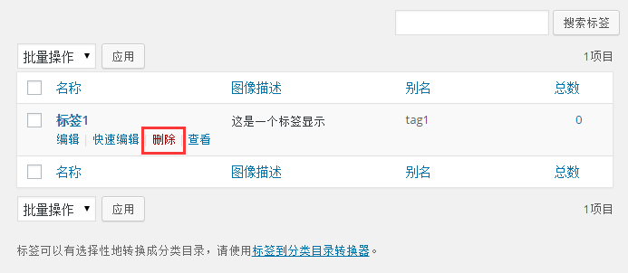
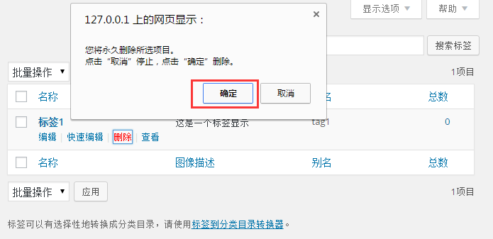

# Wordpress删除标签 - Wordpress教程

在本章中，我们将学习如何在WordPress中删除标签。 

可以学习如何添加标签在[WordPress添加标签章节](http://www.yiibai.com/wordpress/wordpress_add_tags.html) 。以下是简单的步骤来在WordPress中删除标签。

第1步：在WordPress点击 文章-&gt; 标签。

**第2步：**接下来，你可以看到 tag1（tag1是在[WordPress添加标签](http://www.yiibai.com/wordpress/wordpress_add_tags.html)章节中创建）。当光标悬停在标签，有几个选项会显示在标签名称的下方。 Click on 点击删除标签部分，如下图所示。 

当你点击删除，会得到一个弹出消息，要求您确认删除，如下图所示。

您可以点击 确定 按钮，并永久删除标签。

 