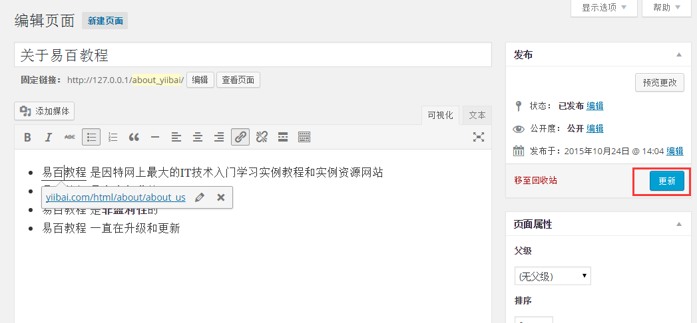

# WordPress添加链接 - Wordpress教程

在本章中，我们将学习如何在WordPress的页面添加链接。链接是从一个资源到另一个的连接。添加链接到网页或博客帖子可以帮助您连接至其他页面。

以下是简单的步骤来在WordPress中添加链接。

**第1步：**在WordPress中点击 **页面** -&gt;**所有页面**，如下图所示。

**第2步：** 接下来，将得到显示在WordPress中创建的页面列表，如下图所示。选择任一页面，以在它里面添加链接。在这里，我们要在 [关于易百教程](http://www.yiibai.com/html/about/about_us.html)页面添加链接。

**第3步：**接下来，选择任何句子或单词，你想添加就可以了链接。在这里，我们将添加链接到 

**第4步：** 接下来，当你点击插入/编辑链接符号然后弹出如下窗口(显示出来)。

下面是插入/编辑链接的字段。

*   URL: 输入你要链接的网址(目标网址)。

*   链接文本: 将要进入链接文本。

*   在新窗口或标签页打开链接: 它会打开网页链接到新的标签或窗口，根据需要勾选。

*   或链接到站点中的内容: 它通过从给定的列表中选择的页面链接到现有的内容页。点击或链接到站点中的内容，网页和帖子列表获取显示如下图所示。

    

    从列表中选择特定页面或文章后，则该链接的URL字段创建如上图所示。点击添加链接。

**第5步：** 接着，如果对这些字悬停 易百教程 那么链路提示获得显示如下所示。

接下来，点击更新按钮来更新改变你的页面或文章。

 