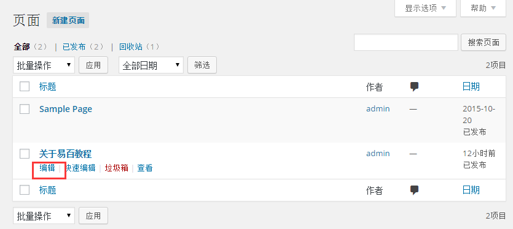
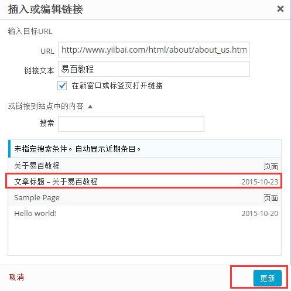
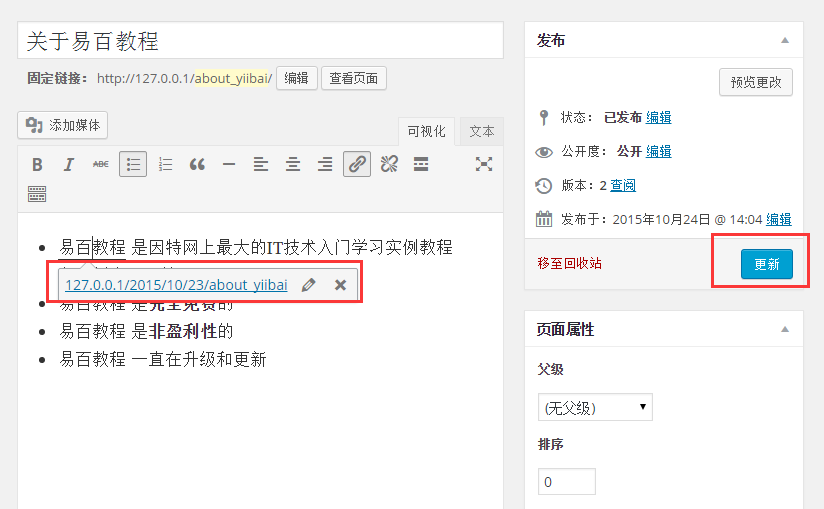

# WordPress编辑链接 - Wordpress教程

在本章中，我们将研究如何在WordPress中编辑链接。你可以在[WordPress添加链接](http://www.yiibai.com/wordpress/wordpress_add_links.html)这一章节中学习如何添加链接。

以下是简单的步骤来在WordPress编辑链接

**第1步：**点击**页面** -&gt;**所有页面**，如下图所示。

**第2步：**接下来，您可以查看页面列表。当光标悬停在 **关于易百教程** 页面上，几个选项被显示在 **关于易百教程** 的下面。点击编辑，如图所示。

****第3步：****接下来，将鼠标悬停在 关于易百教程（在 [WordPress创建链接](http://www.yiibai.com/wordpress/wordpress_add_links.html) 这一章节中创建），  并单击铅笔符号来编辑链接，如下图所示。

****第4步：****接下来，您可以从现有列表中选择页面中更改或修改链接。这里我们选择 关于易百教程 页面。

从列表中选择特定的页面或文章后，然后点击 更新 按钮。

****第5步：****接着，如果对 易百教程 悬停那么链接提示如下所示。

接下来，点击更新按钮来更新改变你的页面或文章。

 