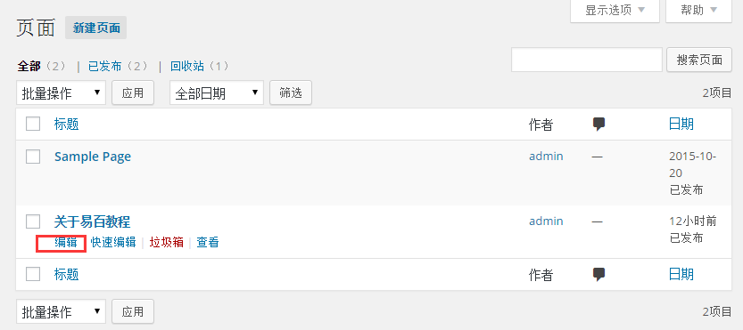
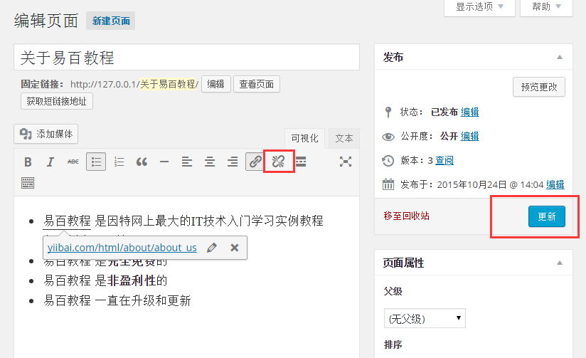
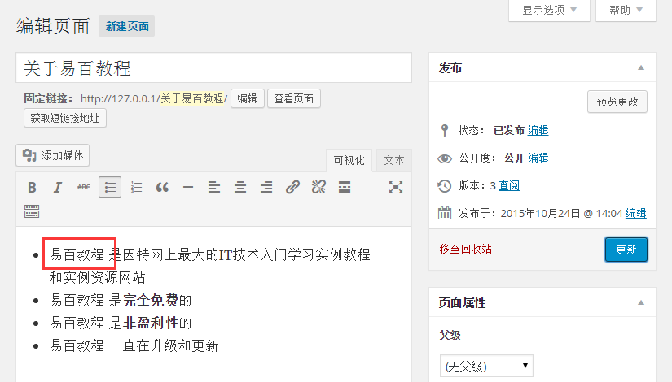

# Wordpress删除链接 - Wordpress教程

在本章中，我们将学习如何在WordPress中删除链接。你可以在[WordPress添加链接](http://www.yiibai.com/wordpress/wordpress_add_links.html)这一章节中学习如何添加链接。

以下是简单的步骤来在WordPress删除链接

第1步：点击页面 -&gt;所有页面，如下图所示。

**第2步：**接下来，可以查看页面列表。当光标悬停在 **关于易百教程** 页面上，几个选项显示 关于易百教程 的名称下面。点击**编辑**，如图所示。

****第3步：****接下来，选择您已经添加链接的话，即 **易百教程**（链接 **易百教程** 是[WordPress添加链接](http://www.yiibai.com/wordpress/wordpress_add_links.html)中创建的），然后点击 **删除链接** 代码，如下图所示。

****第4步：**** 接着，如果对这些 **易百教程** 悬停，就没有现有工具提示URL。

 