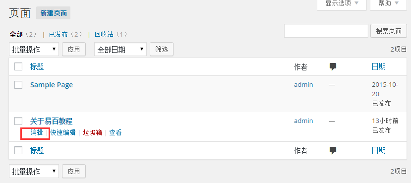
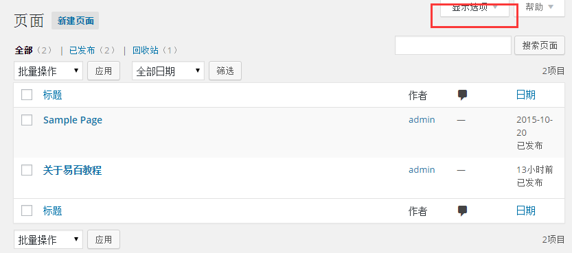
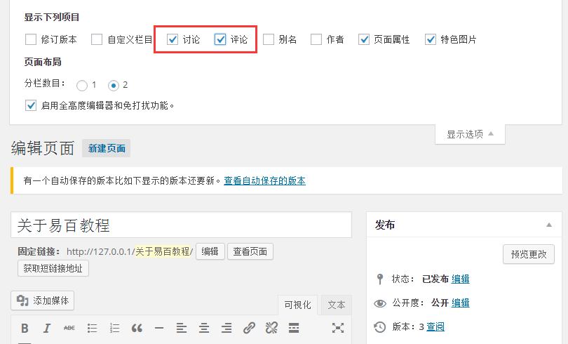
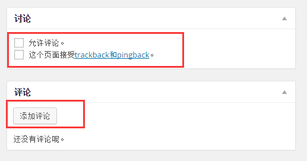
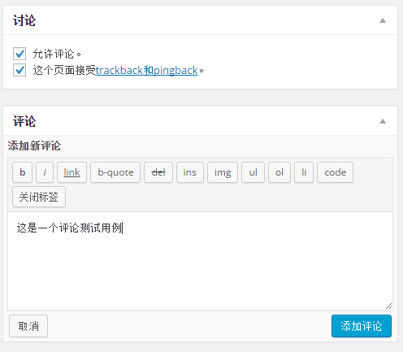

# WordPress添加评论 - Wordpress教程

在本章中，我们将学习如何在WordPress中添加评论。添加评论可以让你的访客参与评论。评论由管理员审核发布以进一步讨论。

按照以下步骤将评论添加到您的博客文章。

**步骤(1)：**在WordPress中点击 **页面** -&gt; **所有页面**。

****步骤(2)：****在WordPress中创建的页面将显示列表如下图所示。选择任何你想要添加注释的页面。在这里，我们要添加评论到 关于易百教程 页面。点击关于易百教程。

****步骤(3)：****接着，添加评论此页面上，点击出现在左上方的角落屏幕的选项。

****步骤(4)：****接下来，获取显示的屏幕选项的下拉列表。检查讨论和评论，如下图所示。

****步骤(5)：****接下来，可以在页面的底部查看讨论和评论框。

在评论部分，有两个选项存在：

*   **允许评论:** 让游客在你的博客文章和网页发表评论。
*   **这个页面接受trackback和pingback。:** 让游客给ping和引用通告。

在评论部分中，您可以通过点击添加评论按钮添加评论。

****步骤(6)：****添加评论之后，点击更新按钮。

 