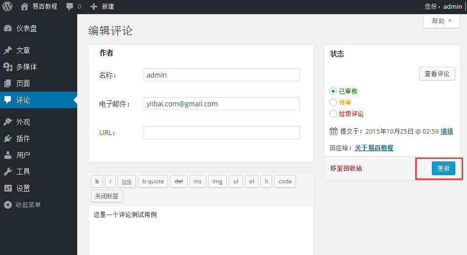
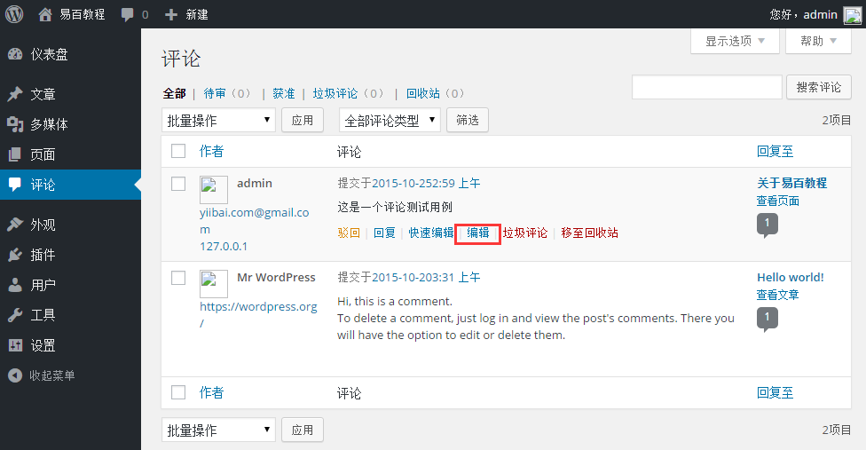
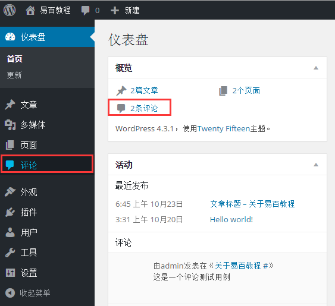

# Wordpress编辑评论 - Wordpress教程

在本章中，我们将学习如何在WordPress中编辑评论。编辑评论只能由管理员来完成。你可以学习如何在[WordPress添加评论](http://www.yiibai.com/wordpress/wordpress_add_comments.html)。

按照以下步骤是在WordPress中编辑评论。

**步骤(1)：**在WordPress中点击评论。

**步骤（2）：**接下来，你可以查看评论列表中的各个页面。选择任何评论对其进行编辑。点击编辑。

**步骤（3）：**接下来，编辑注释页面得到展示。您可以编辑注释，点击更新按钮。

在这里，可以编辑姓名，电子邮件，URL或评论框的评论内容。

 