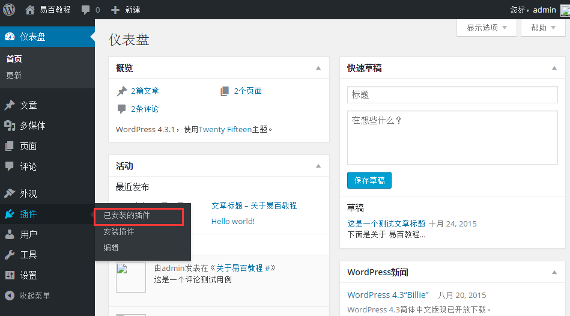
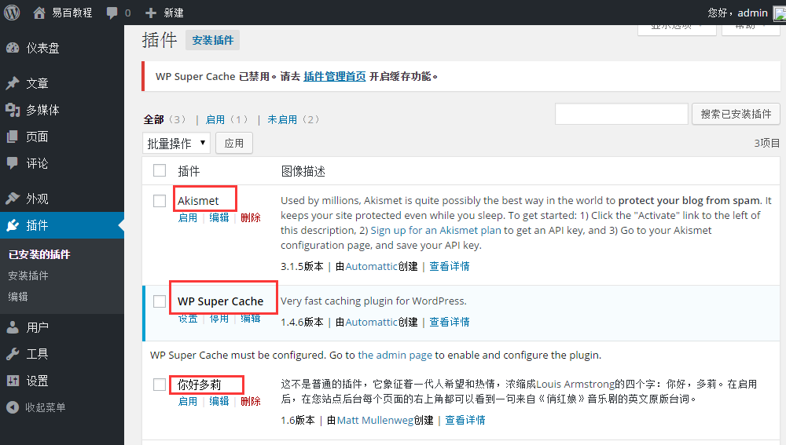

# WordPress查看插件 - Wordpress教程

在本章中，我们将研究如何在WordPress中查看插件。它可以帮助你启用和禁用WordPress插件。这增加了网站独特的功能。插件扩展和扩大WordPress的功能。

以下是简单的步骤来在在WordPress查看插件。

**步骤(1)：**管理员在 WordPress 中点击 **插件** -&gt; **已安装的插件**，如下图所示。

**步骤（2）：**接下来，会看到您网站上的现有插件列表，如下图所示：

这里，将显示用插件和描述的表格。该插件的名称在插件栏定义，对插件的简要说明根据描述列来定义。

**工具栏：**

以下是在插件工具栏的选项：

*   **启用****：**显示了网站上的活动（启用）插件。

*   **未启用：**显示已安装的插件，但处于非活动（未启用）状态的网站上。

*   **更新可用：** 显示如果有新版本可用，或者要求立即更新。

 