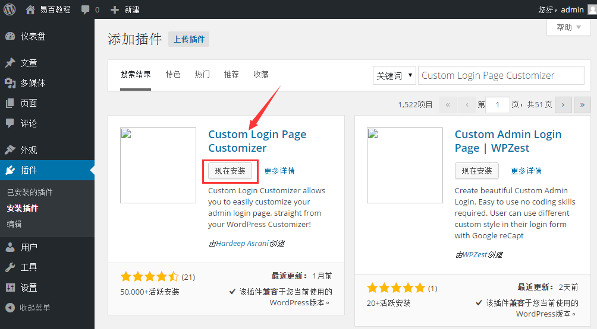
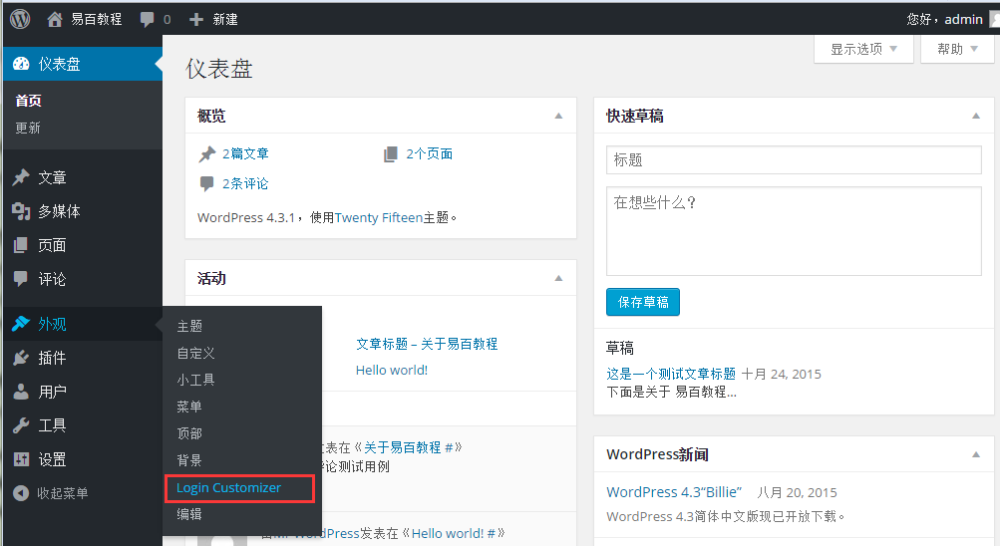
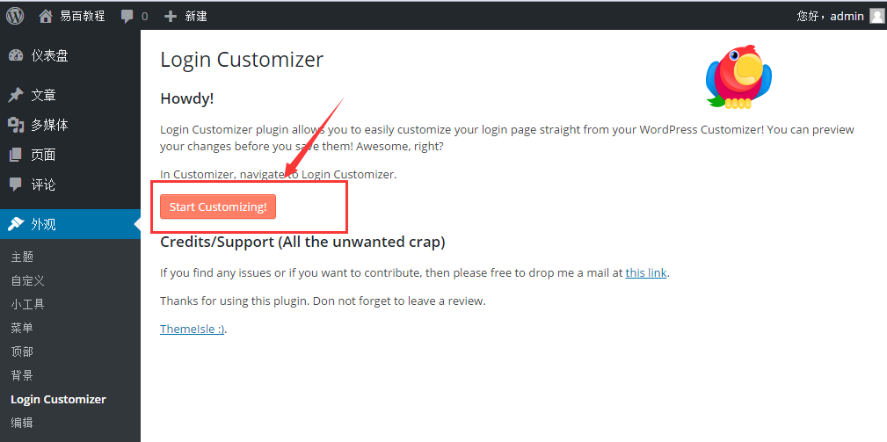
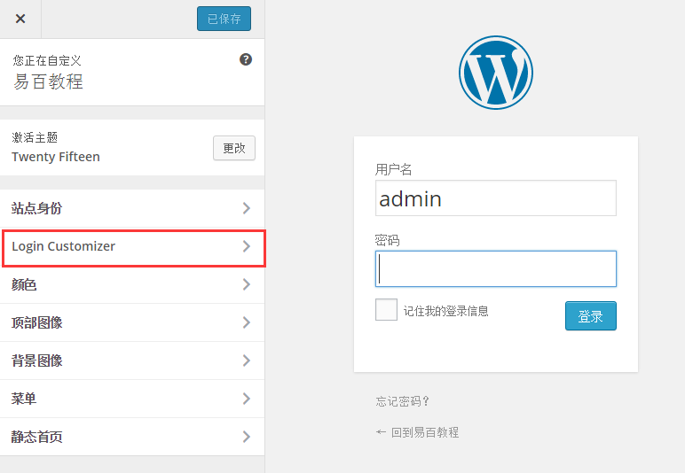
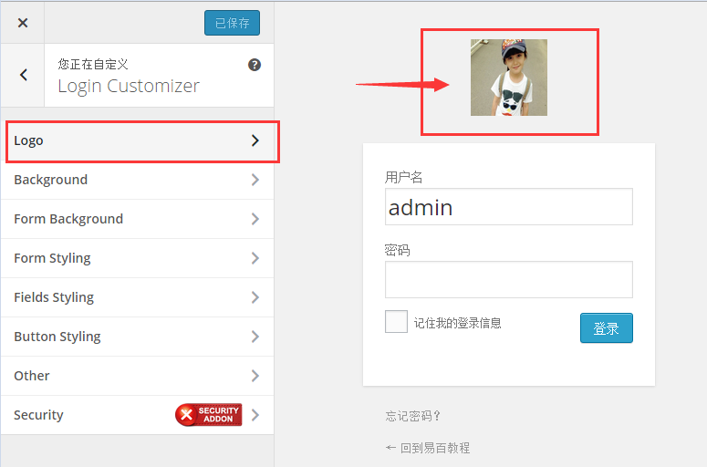

# WordPress自定义插件 - Wordpress教程

在本章中，我们将学习如何在WordPress中自定义插件。它通常是多用户的网站。 在这里，我们了解学习如何在无需编写任何HTML或CSS自定义WordPress插件。 这种新的方法可以让你使用WordPress主题定制(无需编码技能)来定制你的登录页面。

以下是简单的步骤，在WordPress自定义插件。

步骤(1)：在WordPress中点击 插件 -&gt; 安装插件。

**步骤（2）：**安装并激活自定义登录页面自定义插件（**Custom Login Page Customizer**）。

**步骤（3）：**接下来，在 WordPress 点击 **外观** -&gt; **Login Customizer(**登录定制)。

**步骤（4）：**点击开始按钮，进一步进行自定义。

**步骤（5）：**接下来，它将启动内置 WordPress 主题定制。可以自定义你想要的主题方式。

在这里，点击侧面板中的新 Login Customizer 选项卡上。登录定制页面将得到显示。在登录定制页面，可以用同样的方式来定制你的登录页面，可以自定义WordPress的主题。

**步骤（6）：**接下来，您将看到自定义登录页面，作为一个演示示例，这里只是修改了登陆的Logo，如下图所示。

*   **标志：**选择上传标志来替换默认WordPress标志。

*   **背景：**添加背景图片，或者您可以选择您所选择的背景色。

*   **表格背景：**选择表单背景图片或颜色选择登录表单容器。

大多数选择在定制面板是透明的。可以检查出所有按您要求选择的定制调整设置登录页。点击**保存并发布**按钮。

 