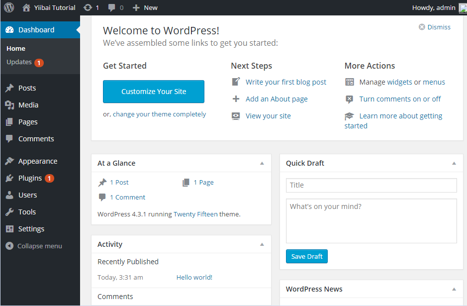

# Wordpress仪表板 - Wordpress教程

WordPress的仪表盘是当登录到你的博客后的管理区域，这将显示该网站的介绍，这是登陆成功后的第一个画面。这些小工具提供信息，并给出了所发生的事情并显示博客在一个一目了然概述的集合。 可以通过使用一些快速链接，如快速写入草案自定义您的需求，回复最新评论等。

仪表盘可分类如下所示。每个类别将在以下部分中讨论：

## 仪表盘菜单

WordPress 的控制板提供了包含某些菜单选项，如发表帖子，媒体库，页面，评论，外观选项，插件，用户，工具和设置在左侧导航菜单。

## Screen Options - 屏幕选项

仪表板包含不同类型的小部件可以显示或隐藏屏幕。它包含复选框，以显示或隐藏屏幕选项，也可以让管理员屏幕上的定制部分选项。

## Welcome - 欢迎部分

它包括自定义网站的按钮，允许自定义 WordPress 主题。中央列提供了一些如创建一个博客文章，创建一个页面，查看网站前端的有用的链接。最后一列包含链接到相关的评论窗口小部件，菜单设置，以及在 WordPress 的手抄本链接到 WordPress 的页面等。

## Quick Draft -快速草稿

快速草稿是一个小型的帖子编辑器允许书写，保存和发布后的管理仪表板。它包括对草案的标题，草案的一些注意事项，并将其保存为草稿。

## WordPress News - WordPress新闻

WordPress新闻插件显示最新消息，如最新的软件版本，更新，警报，新闻就来自WordPress官方博客软件等。

## Activity - 活动

活动部件包括博客的最新评论，最近的帖子，最近发布的文章。它可以让取消审核或批准的评论，回复评论，编辑注释也可以删除评论或将其移动到垃圾邮件。

## At a Glance - 概览

本节提供了概述博客帖子，发表文章和页面，评论的数量。当点击这些链接，将使用相应的屏幕。它显示目前在网站上运行的主题运行WordPress的最新版本。

 