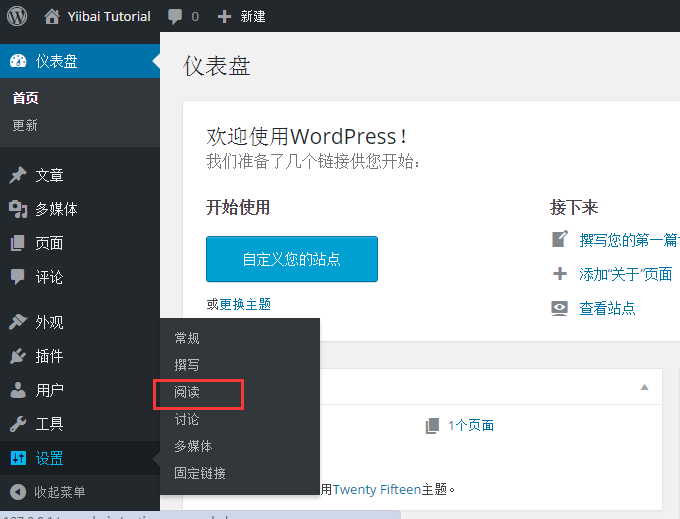
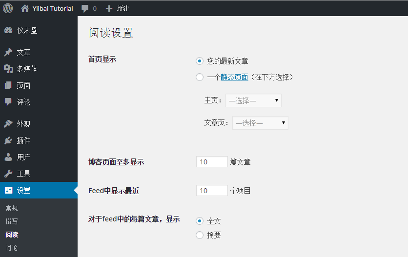

# Wordpress阅读设置 - Wordpress教程

在本章中，我们将研究有关在WordPress的阅读设置。阅读设置用于设置相关前端页面的内容。在这里你可以设置在主页上显示文章的数量。

要访问的阅读设置，只需遵循以下步骤：

**Step (1):**点击 设置 -&gt; 阅读 选项在WordPress中.

**Step(2):**接着，将显示阅读设置页面如下。

以下是阅读设置的字段细节。

*   **首页显示****:**这部分是用来显示在以下任何格式的头版：

    *   您的最新文章: 它显示在头版最新的文章。

    *   一个静态页面（下面选择）: 它显示在头版上的静态页面。

        *   主页：可以从下拉显示选择想要在头版的实际页面。

        *   文章面: 可以选择其中包含文章的下拉页面。

*   **博客页面最多显示：** 每个页面或网站上显示文章的数量。缺省情况下，它设置为10。

*   **Feed中显示最近****:**当他们下载网站的feeds，订阅的用户可以查看文章的数目。缺省情况下，它被设置为10。

*   **对于feed中的每篇文章，显示:** 此部分用于选择以下任何一种格式来显示日志：

    *   全文: 它显示了完整的文章。这是默认的设置。

    *   摘要: 它显示的文章的摘要。

*   **搜索引擎可见性：**点击复选框后，不鼓励搜索引擎索引，从这个网站，你的网站会被搜索引擎忽略。

**Step(3):**填充所有的信息后，接下来点击 保存更改 按钮保存您的阅读设置等信息。

 