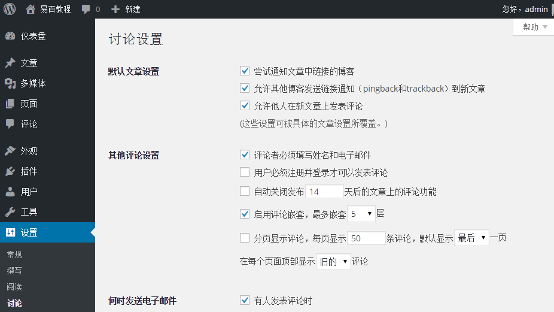

# Wordpress讨论设置 - Wordpress教程

在本章中，我们将研究有关在WordPress的讨论设置。WordPress讨论设置可以定义博主与访问者之间的互动。这些设置由管理员做是为了控制通过文章/网页访问的用户。

要访问讨论的设置，只需按照以下步骤操作：

**Step 1:**点击 **设置** -&gt; **讨论选项** 在WordPress。

**Step 2:** 接着，将显示讨论设置页面如下所示。

以下是讨论设置的字段。

*   **默认文章设置****:**这些设置是默认创建新页面或新文章。这包含三个设置。 它们是：

    *   尝试通知文章中链接的博客：当您发布的文章则给出通知（发送ping和引用通告）到其他博客。

    *   允许其他博客发送链接通知（pingback和trackback）到新文章: 接受来自其他博客的ping。

    *   允许他人在新文章上发表评论: 可以允许或禁止他人使用该设定你的文章发表评论。

    您可以更改设置，根据您的意愿为个人文章。

*   **其他评论设置****:**此设置有以下选项：

    *   评论者必须填写姓名和电子邮件 : 当您选中该复选框，其强制性的访问时填补他们的姓名和电子邮件地址。

    *   用户必须注册并登录才可以发表评论: 如果您选中该复选框，只有已注册那些人才可以发表评论，如果没有选中，任何人都可以发布任何数量的评论。

    *   自动关闭发布x天后的文章上的评论功能: 此选项根据您的意愿可以接受评论仅适用于一个特定的时间段。

    *   启用评论嵌套，最多嵌套x层: 当您选中此选项，游客可以回复或有一个讨论，并得到响应。

    *   分页显示评论，每页显示条评论，默认显示最后最前一页: 如果您的网页有很多评论，那么可以选中此复选框将它们分为不同的页面。

    *   在每个页面顶部显示旧的新的评论: 可以安排升序或降序排列形式的评论。

*   **何时发送电子邮件****：** 此设置包含两个选项，分别是：

    *   有人发表评论时： 当您选中此框中，作者在别人发布每一个评论时会收到电子邮件。

    *   有评论等待审核时： 这是用来如果不希望你的评论进行更新之前，它用于放缓管理。

*   **在评论显示之前：** 此设置允许如何您的文章被控制。有两个设置如下：

    *   评论必须经人工审核： 如果您选中此复选框，然后只能由管理员批准的评论可以在文章或页面显示。

    *   评论者先前须有评论通过了审核: 选中时确定批准作者，曾这样评论先前发布的评论的电子邮件地址相匹配的注释进行检查，否则评论等待审核。

*   **评论审核：**包含被允许进入一个注释，链接只是一个具体的数字。

*   **评论黑名单：**可以输入自己的垃圾邮件个词语，不希望访问者进入评论，网址，电子邮件等之后它会过滤评论。

*   **头像:**头像是一个小图像，在你的名字旁边的仪表盘屏幕的顶部右上角显示。这就像你的个人资料图片。在这里有更多的选项，可以设置你的WordPress网站的头像。

    *   头像显示: 除了名字外它显示你的头像。

    *   最高等级: 在这里有替身，可以使用的其他四个选项。它们是G，PG，R和X。这是根据你想显示文章哪种类型选择读者的年龄段。

    *   默认头像: 在这个选项中有几个类型的替身与图像; 可以根据您的访问者的电子邮件地址使用这些替身。

**Step 3:** 接下来，您可以点击 **保存改变** 按钮保存更改。

 